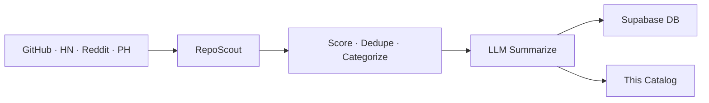

# 🌟 Open Scout Catalog

> Auto-curated catalog of promising open-source projects.
> Scouted from GitHub · HackerNews · Reddit · ProductHunt. Updated every 30 minutes by [RepoScout](https://github.com/kirbudilov01/reposearchengine).

---

## 📊 At a glance

| | |
|---|---|
| 🗂️ **Total projects** | **9189** |
| 📁 **Categories** | **16** |
| 🔄 **Auto-sync** | every 30 min via GitHub Actions |
| 🧠 **Summaries** | LLM-generated (OpenRouter · Ollama · Claude · OpenAI) |

## 🗂️ Categories

| Category | Projects | |
|---|---|---|
| 🤖 **AI/ML** | 3542 | [Browse →](./aiml/) |
| 📦 **Misc** | 1704 | [Browse →](./misc/) |
| 🎨 **Frontend** | 918 | [Browse →](./frontend/) |
| 🧩 **Orchestration** | 762 | [Browse →](./orchestration/) |
| ⚙️ **Backend** | 534 | [Browse →](./backend/) |
| 🔧 **DevTools** | 528 | [Browse →](./devtools/) |
| ⛓️ **Crypto** | 331 | [Browse →](./crypto/) |
| 📊 **Data** | 196 | [Browse →](./data/) |
| 🚀 **DevOps & Infra** | 186 | [Browse →](./devopsinfra/) |
| 📱 **Mobile** | 123 | [Browse →](./mobile/) |
| 💳 **Payments** | 114 | [Browse →](./payments/) |
| 📈 **Trading** | 94 | [Browse →](./trading/) |
| 🔐 **Security** | 83 | [Browse →](./security/) |
| ✨ **Design** | 33 | [Browse →](./design/) |
| 🎯 **Product** | 22 | [Browse →](./product/) |
| 🏷️ **Marketing** | 19 | [Browse →](./marketing/) |

## 🔥 Top 10 by score

| # | Project | Stars | Category |
|---|---|---|---|
| 1 | [ruvnet/ruflo](./orchestration/ruvnet-ruflo.md) | ⭐ 33.7k | Orchestration |
| 2 | [electerm/electerm](./aiml/electerm-electerm.md) | ⭐ 14k | AI/ML |
| 3 | [mermaid-js/mermaid](./aiml/mermaid-js-mermaid.md) | ⭐ 87.7k | AI/ML |
| 4 | [SigmaHQ/sigma](./aiml/sigmahq-sigma.md) | ⭐ 10.4k | AI/ML |
| 5 | [microsoft/promptflow](./aiml/microsoft-promptflow.md) | ⭐ 11.1k | AI/ML |
| 6 | [JanDeDobbeleer/oh-my-posh](./misc/jandedobbeleer-oh-my-posh.md) | ⭐ 22.3k | Misc |
| 7 | [ankidroid/Anki-Android](./mobile/ankidroid-anki-android.md) | ⭐ 11.1k | Mobile |
| 8 | [wolfpld/tracy](./misc/wolfpld-tracy.md) | ⭐ 15.7k | Misc |
| 9 | [BabylonJS/Babylon.js](./misc/babylonjs-babylon.js.md) | ⭐ 25.4k | Misc |
| 10 | [grafana/k6](./devtools/grafana-k6.md) | ⭐ 30.5k | DevTools |

## 🚀 How it works



1. **Discover** — 4 sources pulled in parallel
2. **Score** — weighted: stars, forks, recency, topics, source trust
3. **Categorize** — rule-based + LLM-assisted tagging
4. **Summarize** — concise bilingual (EN/RU) summaries via LLM
5. **Sync** — markdown committed here, metadata upserted to Supabase

## 🛠️ Self-host

```bash
git clone https://github.com/kirbudilov01/reposearchengine
cp .env.example .env
# Set LLM_PROVIDER, CATALOG_REPO_PATH, SUPABASE_URL, ...
npm install && npm start
```

Supports local LLMs (Ollama) and cloud providers (OpenAI · Anthropic · OpenRouter).

## 📦 Data format

- [`index.json`](./index.json) — full catalog sorted by score
- `<category>/README.md` — category index with ranked table
- `<category>/<owner>-<name>.md` — per-repo card with stats, topics, summary

## 📜 License

MIT (metadata). Each linked repository retains its own license.

---

<sub>🤖 Maintained automatically by RepoScout · Built with Claude Code</sub>
