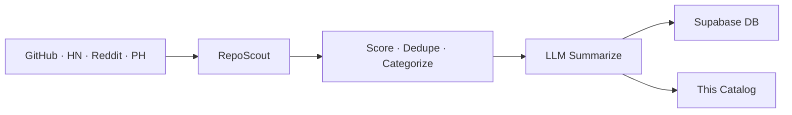

# 🌟 Open Scout Catalog

> Auto-curated catalog of promising open-source projects.
> Scouted from GitHub · HackerNews · Reddit · ProductHunt. Updated every 30 minutes by [RepoScout](https://github.com/kirbudilov01/reposearchengine).

---

## 📊 At a glance

| | |
|---|---|
| 🗂️ **Total projects** | **3985** |
| 📁 **Categories** | **16** |
| 🔄 **Auto-sync** | every 30 min via GitHub Actions |
| 🧠 **Summaries** | LLM-generated (OpenRouter · Ollama · Claude · OpenAI) |

## 🗂️ Categories

| Category | Projects | |
|---|---|---|
| 🤖 **AI/ML** | 1529 | [Browse →](./aiml/) |
| 📦 **Misc** | 625 | [Browse →](./misc/) |
| 🎨 **Frontend** | 413 | [Browse →](./frontend/) |
| 🧩 **Orchestration** | 373 | [Browse →](./orchestration/) |
| ⚙️ **Backend** | 239 | [Browse →](./backend/) |
| 🔧 **DevTools** | 224 | [Browse →](./devtools/) |
| ⛓️ **Crypto** | 159 | [Browse →](./crypto/) |
| 📊 **Data** | 103 | [Browse →](./data/) |
| 🚀 **DevOps & Infra** | 90 | [Browse →](./devopsinfra/) |
| 📱 **Mobile** | 55 | [Browse →](./mobile/) |
| 💳 **Payments** | 54 | [Browse →](./payments/) |
| 📈 **Trading** | 45 | [Browse →](./trading/) |
| 🔐 **Security** | 43 | [Browse →](./security/) |
| ✨ **Design** | 15 | [Browse →](./design/) |
| 🎯 **Product** | 13 | [Browse →](./product/) |
| 🏷️ **Marketing** | 5 | [Browse →](./marketing/) |

## 🔥 Top 10 by score

| # | Project | Stars | Category |
|---|---|---|---|
| 1 | [googleapis/mcp-toolbox](./aiml/googleapis-mcp-toolbox.md) | ⭐ 14.8k | AI/ML |
| 2 | [microsoft/terminal](./misc/microsoft-terminal.md) | ⭐ 102.9k | Misc |
| 3 | [OpenBB-finance/OpenBB](./crypto/openbb-finance-openbb.md) | ⭐ 66.5k | Crypto |
| 4 | [saleor/saleor](./payments/saleor-saleor.md) | ⭐ 22.8k | Payments |
| 5 | [rustfs/rustfs](./aiml/rustfs-rustfs.md) | ⭐ 26.4k | AI/ML |
| 6 | [prometheus/alertmanager](./aiml/prometheus-alertmanager.md) | ⭐ 8.4k | AI/ML |
| 7 | [volcengine/OpenViking](./aiml/volcengine-openviking.md) | ⭐ 23k | AI/ML |
| 8 | [f/prompts.chat](./aiml/f-prompts.chat.md) | ⭐ 160.6k | AI/ML |
| 9 | [envoyproxy/envoy](./misc/envoyproxy-envoy.md) | ⭐ 27.9k | Misc |
| 10 | [x-extends/vxe-table](./frontend/x-extends-vxe-table.md) | ⭐ 8.6k | Frontend |

## 🚀 How it works



1. **Discover** — 4 sources pulled in parallel
2. **Score** — weighted: stars, forks, recency, topics, source trust
3. **Categorize** — rule-based + LLM-assisted tagging
4. **Summarize** — concise bilingual (EN/RU) summaries via LLM
5. **Sync** — markdown committed here, metadata upserted to Supabase

## 🛠️ Self-host

```bash
git clone https://github.com/kirbudilov01/reposearchengine
cp .env.example .env
# Set LLM_PROVIDER, CATALOG_REPO_PATH, SUPABASE_URL, ...
npm install && npm start
```

Supports local LLMs (Ollama) and cloud providers (OpenAI · Anthropic · OpenRouter).

## 📦 Data format

- [`index.json`](./index.json) — full catalog sorted by score
- `<category>/README.md` — category index with ranked table
- `<category>/<owner>-<name>.md` — per-repo card with stats, topics, summary

## 📜 License

MIT (metadata). Each linked repository retains its own license.

---

<sub>🤖 Maintained automatically by RepoScout · Built with Claude Code</sub>
