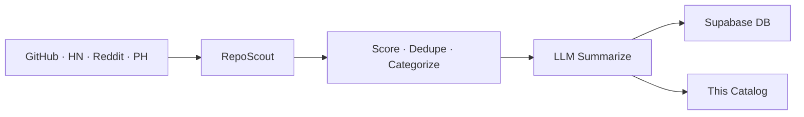

# 🌟 Open Scout Catalog

> Auto-curated catalog of promising open-source projects.
> Scouted from GitHub · HackerNews · Reddit · ProductHunt. Updated every 30 minutes by [RepoScout](https://github.com/kirbudilov01/reposearchengine).

---

## 📊 At a glance

| | |
|---|---|
| 🗂️ **Total projects** | **2319** |
| 📁 **Categories** | **15** |
| 🔄 **Auto-sync** | every 30 min via GitHub Actions |
| 🧠 **Summaries** | LLM-generated (OpenRouter · Ollama · Claude · OpenAI) |

## 🗂️ Categories

| Category | Projects | |
|---|---|---|
| 🤖 **AI/ML** | 872 | [Browse →](./aiml/) |
| 📦 **Misc** | 386 | [Browse →](./misc/) |
| 🎨 **Frontend** | 252 | [Browse →](./frontend/) |
| 🧩 **Orchestration** | 202 | [Browse →](./orchestration/) |
| ⚙️ **Backend** | 149 | [Browse →](./backend/) |
| 🔧 **DevTools** | 118 | [Browse →](./devtools/) |
| ⛓️ **Crypto** | 92 | [Browse →](./crypto/) |
| 📊 **Data** | 68 | [Browse →](./data/) |
| 🚀 **DevOps & Infra** | 55 | [Browse →](./devopsinfra/) |
| 📱 **Mobile** | 32 | [Browse →](./mobile/) |
| 💳 **Payments** | 29 | [Browse →](./payments/) |
| 🔐 **Security** | 24 | [Browse →](./security/) |
| 📈 **Trading** | 24 | [Browse →](./trading/) |
| ✨ **Design** | 8 | [Browse →](./design/) |
| 🎯 **Product** | 8 | [Browse →](./product/) |

## 🔥 Top 10 by score

| # | Project | Stars | Category |
|---|---|---|---|
| 1 | [VoltAgent/awesome-agent-skills](./orchestration/voltagent-awesome-agent-skills.md) | ⭐ 18k | Orchestration |
| 2 | [bytecodealliance/wasmtime](./misc/bytecodealliance-wasmtime.md) | ⭐ 17.9k | Misc |
| 3 | [daytonaio/daytona](./orchestration/daytonaio-daytona.md) | ⭐ 72.4k | Orchestration |
| 4 | [navidrome/navidrome](./aiml/navidrome-navidrome.md) | ⭐ 20.6k | AI/ML |
| 5 | [Mintplex-Labs/anything-llm](./aiml/mintplex-labs-anything-llm.md) | ⭐ 58.9k | AI/ML |
| 6 | [doocs/leetcode](./misc/doocs-leetcode.md) | ⭐ 35.9k | Misc |
| 7 | [ankidroid/Anki-Android](./mobile/ankidroid-anki-android.md) | ⭐ 11k | Mobile |
| 8 | [streamlit/streamlit](./aiml/streamlit-streamlit.md) | ⭐ 44.3k | AI/ML |
| 9 | [endless-sky/endless-sky](./trading/endless-sky-endless-sky.md) | ⭐ 7.3k | Trading |
| 10 | [browseros-ai/BrowserOS](./aiml/browseros-ai-browseros.md) | ⭐ 10.6k | AI/ML |

## 🚀 How it works



1. **Discover** — 4 sources pulled in parallel
2. **Score** — weighted: stars, forks, recency, topics, source trust
3. **Categorize** — rule-based + LLM-assisted tagging
4. **Summarize** — concise bilingual (EN/RU) summaries via LLM
5. **Sync** — markdown committed here, metadata upserted to Supabase

## 🛠️ Self-host

```bash
git clone https://github.com/kirbudilov01/reposearchengine
cp .env.example .env
# Set LLM_PROVIDER, CATALOG_REPO_PATH, SUPABASE_URL, ...
npm install && npm start
```

Supports local LLMs (Ollama) and cloud providers (OpenAI · Anthropic · OpenRouter).

## 📦 Data format

- [`index.json`](./index.json) — full catalog sorted by score
- `<category>/README.md` — category index with ranked table
- `<category>/<owner>-<name>.md` — per-repo card with stats, topics, summary

## 📜 License

MIT (metadata). Each linked repository retains its own license.

---

<sub>🤖 Maintained automatically by RepoScout · Built with Claude Code</sub>
