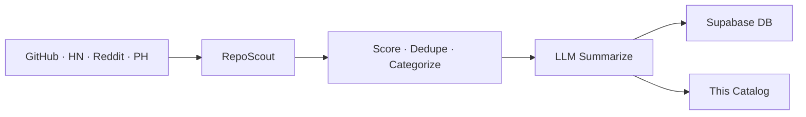

# 🌟 Open Scout Catalog

> Auto-curated catalog of promising open-source projects.
> Scouted from GitHub · HackerNews · Reddit · ProductHunt. Updated every 30 minutes by [RepoScout](https://github.com/kirbudilov01/reposearchengine).

---

## 📊 At a glance

| | |
|---|---|
| 🗂️ **Total projects** | **12001** |
| 📁 **Categories** | **16** |
| 🔄 **Auto-sync** | every 30 min via GitHub Actions |
| 🧠 **Summaries** | LLM-generated (OpenRouter · Ollama · Claude · OpenAI) |

## 🗂️ Categories

| Category | Projects | |
|---|---|---|
| 🤖 **AI/ML** | 4571 | [Browse →](./aiml/) |
| 📦 **Misc** | 2328 | [Browse →](./misc/) |
| 🎨 **Frontend** | 1172 | [Browse →](./frontend/) |
| 🧩 **Orchestration** | 944 | [Browse →](./orchestration/) |
| ⚙️ **Backend** | 733 | [Browse →](./backend/) |
| 🔧 **DevTools** | 710 | [Browse →](./devtools/) |
| ⛓️ **Crypto** | 428 | [Browse →](./crypto/) |
| 📊 **Data** | 264 | [Browse →](./data/) |
| 🚀 **DevOps & Infra** | 259 | [Browse →](./devopsinfra/) |
| 📱 **Mobile** | 148 | [Browse →](./mobile/) |
| 💳 **Payments** | 129 | [Browse →](./payments/) |
| 📈 **Trading** | 124 | [Browse →](./trading/) |
| 🔐 **Security** | 107 | [Browse →](./security/) |
| ✨ **Design** | 37 | [Browse →](./design/) |
| 🎯 **Product** | 25 | [Browse →](./product/) |
| 🏷️ **Marketing** | 22 | [Browse →](./marketing/) |

## 🔥 Top 10 by score

| # | Project | Stars | Category |
|---|---|---|---|
| 1 | [argoproj/argo-cd](./devopsinfra/argoproj-argo-cd.md) | ⭐ 22.8k | DevOps & Infra |
| 2 | [wpscanteam/wpscan](./aiml/wpscanteam-wpscan.md) | ⭐ 9.6k | AI/ML |
| 3 | [firecracker-microvm/firecracker](./payments/firecracker-microvm-firecracker.md) | ⭐ 33.9k | Payments |
| 4 | [birobirobiro/awesome-shadcn-ui](./frontend/birobirobiro-awesome-shadcn-ui.md) | ⭐ 19.4k | Frontend |
| 5 | [oppia/oppia](./misc/oppia-oppia.md) | ⭐ 6.7k | Misc |
| 6 | [sktime/sktime](./aiml/sktime-sktime.md) | ⭐ 9.7k | AI/ML |
| 7 | [airbytehq/airbyte](./aiml/airbytehq-airbyte.md) | ⭐ 21.2k | AI/ML |
| 8 | [docling-project/docling](./aiml/docling-project-docling.md) | ⭐ 58.8k | AI/ML |
| 9 | [flutter/flutter](./frontend/flutter-flutter.md) | ⭐ 176.1k | Frontend |
| 10 | [rclone/rclone](./aiml/rclone-rclone.md) | ⭐ 56.9k | AI/ML |

## 🚀 How it works



1. **Discover** — 4 sources pulled in parallel
2. **Score** — weighted: stars, forks, recency, topics, source trust
3. **Categorize** — rule-based + LLM-assisted tagging
4. **Summarize** — concise bilingual (EN/RU) summaries via LLM
5. **Sync** — markdown committed here, metadata upserted to Supabase

## 🛠️ Self-host

```bash
git clone https://github.com/kirbudilov01/reposearchengine
cp .env.example .env
# Set LLM_PROVIDER, CATALOG_REPO_PATH, SUPABASE_URL, ...
npm install && npm start
```

Supports local LLMs (Ollama) and cloud providers (OpenAI · Anthropic · OpenRouter).

## 📦 Data format

- [`index.json`](./index.json) — full catalog sorted by score
- `<category>/README.md` — category index with ranked table
- `<category>/<owner>-<name>.md` — per-repo card with stats, topics, summary

## 📜 License

MIT (metadata). Each linked repository retains its own license.

---

<sub>🤖 Maintained automatically by RepoScout · Built with Claude Code</sub>
