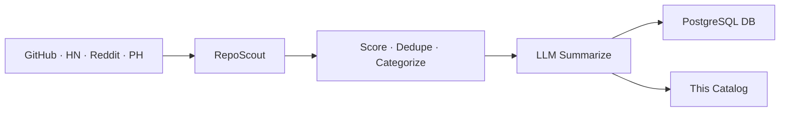

# 🌟 Open Scout Catalog

> Auto-curated catalog of promising open-source projects.
> Scouted from GitHub · HackerNews · Reddit · ProductHunt. Updated every 30 minutes by [RepoScout](https://github.com/kirbudilov01/reposearchengine).

---

## 📊 At a glance

| | |
|---|---|
| 🗂️ **Total projects** | **32901** |
| 📁 **Categories** | **44** |
| 🔄 **Auto-sync** | every 30 min via GitHub Actions |
| 🧠 **Summaries** | LLM-generated (OpenRouter · OpenAI · Anthropic · Gemini · Groq · Z.AI) |

## 🗂️ Categories

| Category | Projects | |
|---|---|---|
| 📦 **Misc** | 7674 | [Browse →](./misc/) |
| 🤖 **AI/ML** | 7657 | [Browse →](./aiml/) |
| 🎨 **Frontend** | 2538 | [Browse →](./frontend/) |
| 🏷️ **Mcp** | 2527 | [Browse →](./mcp/) |
| 🧩 **Orchestration** | 2306 | [Browse →](./orchestration/) |
| 🏷️ **Automation** | 1676 | [Browse →](./automation/) |
| 🔧 **DevTools** | 1547 | [Browse →](./devtools/) |
| ⚙️ **Backend** | 1176 | [Browse →](./backend/) |
| ⛓️ **Crypto** | 990 | [Browse →](./crypto/) |
| 🏷️ **Knowledgerag** | 920 | [Browse →](./knowledgerag/) |
| 🏷️ **Database** | 793 | [Browse →](./database/) |
| 📊 **Data** | 641 | [Browse →](./data/) |
| 📱 **Mobile** | 409 | [Browse →](./mobile/) |
| 💳 **Payments** | 351 | [Browse →](./payments/) |
| 📈 **Trading** | 327 | [Browse →](./trading/) |
| 🚀 **DevOps & Infra** | 295 | [Browse →](./devopsinfra/) |
| 🔐 **Security** | 236 | [Browse →](./security/) |
| 🏷️ **Observability** | 192 | [Browse →](./observability/) |
| 🏷️ **Education** | 151 | [Browse →](./education/) |
| ✨ **Design** | 121 | [Browse →](./design/) |
| 🏷️ **Templates** | 81 | [Browse →](./templates/) |
| 🏷️ **Video-editing** | 79 | [Browse →](./video-editing/) |
| 🏷️ **Marketing** | 53 | [Browse →](./marketing/) |
| 🏷️ **Vertical-video** | 52 | [Browse →](./vertical-video/) |
| 🎯 **Product** | 47 | [Browse →](./product/) |
| 🏷️ **Content-creation** | 39 | [Browse →](./content-creation/) |
| 🏷️ **Python** | 2 | [Browse →](./python/) |
| 🏷️ **Self-hosting** | 2 | [Browse →](./self-hosting/) |
| 🏷️ **Image-processing** | 2 | [Browse →](./image-processing/) |
| 🏷️ **Coding-agent** | 2 | [Browse →](./coding-agent/) |
| 🏷️ **Ai** | 2 | [Browse →](./ai/) |
| 🏷️ **Ai-video** | 1 | [Browse →](./ai-video/) |
| 🏷️ **Lead-generation** | 1 | [Browse →](./lead-generation/) |
| 🏷️ **Ai-coding-agents** | 1 | [Browse →](./ai-coding-agents/) |
| 🏷️ **Nlp** | 1 | [Browse →](./nlp/) |
| 🏷️ **Linkedin** | 1 | [Browse →](./linkedin/) |
| 🏷️ **Web-scraping** | 1 | [Browse →](./web-scraping/) |
| 🏷️ **Aws** | 1 | [Browse →](./aws/) |
| 🏷️ **Korean** | 1 | [Browse →](./korean/) |
| 🏷️ **Llm** | 1 | [Browse →](./llm/) |
| 🏷️ **Developer-tools** | 1 | [Browse →](./developer-tools/) |
| 🏷️ **Windows** | 1 | [Browse →](./windows/) |
| 🏷️ **Ai-coding-agent** | 1 | [Browse →](./ai-coding-agent/) |
| 🏷️ **Open-source** | 1 | [Browse →](./open-source/) |

## 🔥 Top 10 by score

| # | Project | Stars | Category |
|---|---|---|---|
| 1 | [sickn33/agentic-awesome-skills](./orchestration/sickn33-agentic-awesome-skills.md) | ⭐ 42.6k | Orchestration |
| 2 | [Panniantong/Agent-Reach](./mcp/panniantong-agent-reach.md) | ⭐ 44.7k | Mcp |
| 3 | [headroomlabs-ai/headroom](./orchestration/headroomlabs-ai-headroom.md) | ⭐ 46.8k | Orchestration |
| 4 | [xberg-io/xberg](./mcp/xberg-io-xberg.md) | ⭐ 8.5k | Mcp |
| 5 | [xberg-io/kreuzberg](./mcp/xberg-io-kreuzberg.md) | ⭐ 8.5k | Mcp |
| 6 | [diegosouzapw/OmniRoute](./mcp/diegosouzapw-omniroute.md) | ⭐ 6.7k | Mcp |
| 7 | [langgenius/dify](./orchestration/langgenius-dify.md) | ⭐ 146.2k | Orchestration |
| 8 | [zeromicro/go-zero](./aiml/zeromicro-go-zero.md) | ⭐ 33.2k | AI/ML |
| 9 | [wasp-lang/open-saas](./payments/wasp-lang-open-saas.md) | ⭐ 14.9k | Payments |
| 10 | [firerpa/lamda](./mcp/firerpa-lamda.md) | ⭐ 7.9k | Mcp |

## 🚀 How it works


```mermaid
graph LR
  A[GitHub · HN · Reddit · PH] --> B[RepoScout]
  B --> C[Score · Dedupe · Categorize]
  C --> D[LLM Summarize]
  D --> E[PostgreSQL DB]
  D --> F[This Catalog]
```

1. **Discover** — 4 sources pulled in parallel
2. **Score** — weighted: usefulness, quality, integration, production readiness, outlook, adoption
3. **Categorize** — rule-based tagging across product domains, integrations, MCP, RAG, automation and infrastructure
4. **Summarize** — concise RU/EN/ZH summaries via LLM with deterministic fallback
5. **Sync** — markdown committed here, metadata upserted to PostgreSQL

## 🛠️ Self-host

```bash
git clone https://github.com/kirbudilov01/reposearchengine
cp .env.example .env
# Set LLM_PROVIDER, CATALOG_REPO_PATH, DATABASE_URL, ...
npm install && npm start
```

Supports cloud LLM providers (OpenAI · Anthropic · OpenRouter · Gemini · Groq · Z.AI).

## 📦 Data format

- [`index.json`](./index.json) — compact manifest for the sharded machine-readable catalog
- `data/repos-*.json` — catalog shards sorted by score (up to 1000 projects each)
- `<category>/README.md` — category index with ranked table
- `<category>/<owner>-<name>.md` — per-repo card with stats, topics, summary

## 📜 License

MIT (metadata). Each linked repository retains its own license.

---

<sub>🤖 Maintained automatically by RepoScout · Built with Claude Code</sub>
