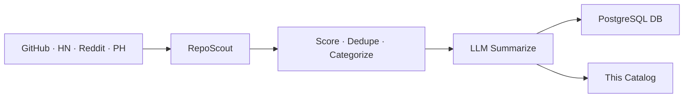

# 🌟 Open Scout Catalog

> Auto-curated catalog of promising open-source projects.
> Scouted from GitHub · HackerNews · Reddit · ProductHunt. Updated every 30 minutes by [RepoScout](https://github.com/kirbudilov01/reposearchengine).

---

## 📊 At a glance

| | |
|---|---|
| 🗂️ **Total projects** | **160** |
| 📁 **Categories** | **16** |
| 🔄 **Auto-sync** | every 30 min via GitHub Actions |
| 🧠 **Summaries** | LLM-generated (OpenRouter · OpenAI · Anthropic · Gemini · Groq · Z.AI) |

## 🗂️ Categories

| Category | Projects | |
|---|---|---|
| 🤖 **AI/ML** | 55 | [Browse →](./aiml/) |
| 📦 **Misc** | 23 | [Browse →](./misc/) |
| 🧩 **Orchestration** | 18 | [Browse →](./orchestration/) |
| 🎨 **Frontend** | 16 | [Browse →](./frontend/) |
| 🏷️ **Mcp** | 11 | [Browse →](./mcp/) |
| 📊 **Data** | 9 | [Browse →](./data/) |
| ⚙️ **Backend** | 9 | [Browse →](./backend/) |
| 📱 **Mobile** | 7 | [Browse →](./mobile/) |
| 🏷️ **Automation** | 4 | [Browse →](./automation/) |
| 🚀 **DevOps & Infra** | 2 | [Browse →](./devopsinfra/) |
| 🔐 **Security** | 1 | [Browse →](./security/) |
| 🔧 **DevTools** | 1 | [Browse →](./devtools/) |
| ✨ **Design** | 1 | [Browse →](./design/) |
| 💳 **Payments** | 1 | [Browse →](./payments/) |
| 🏷️ **Knowledgerag** | 1 | [Browse →](./knowledgerag/) |
| ⛓️ **Crypto** | 1 | [Browse →](./crypto/) |

## 🔥 Top 10 by score

| # | Project | Stars | Category |
|---|---|---|---|
| 1 | [headroomlabs-ai/headroom](./orchestration/headroomlabs-ai-headroom.md) | ⭐ 56.2k | Orchestration |
| 2 | [BerriAI/litellm](./orchestration/berriai-litellm.md) | ⭐ 52.5k | Orchestration |
| 3 | [can1357/oh-my-pi](./mcp/can1357-oh-my-pi.md) | ⭐ 15.8k | Mcp |
| 4 | [hey-api/hey-api](./payments/hey-api-hey-api.md) | ⭐ 5k | Payments |
| 5 | [archestra-ai/archestra](./mcp/archestra-ai-archestra.md) | ⭐ 3.9k | Mcp |
| 6 | [esengine/DeepSeek-Reasonix](./orchestration/esengine-deepseek-reasonix.md) | ⭐ 25.8k | Orchestration |
| 7 | [google/adk-python](./orchestration/google-adk-python.md) | ⭐ 20.4k | Orchestration |
| 8 | [ruvnet/ruflo](./orchestration/ruvnet-ruflo.md) | ⭐ 62.8k | Orchestration |
| 9 | [mock-server/mockserver-monorepo](./mcp/mock-server-mockserver-monorepo.md) | ⭐ 4.9k | Mcp |
| 10 | [vstorm-co/full-stack-ai-agent-template](./orchestration/vstorm-co-full-stack-ai-agent-template.md) | ⭐ 1.5k | Orchestration |

## 🚀 How it works


```mermaid
graph LR
  A[GitHub · HN · Reddit · PH] --> B[RepoScout]
  B --> C[Score · Dedupe · Categorize]
  C --> D[LLM Summarize]
  D --> E[PostgreSQL DB]
  D --> F[This Catalog]
```

1. **Discover** — 4 sources pulled in parallel
2. **Score** — weighted: usefulness, quality, integration, production readiness, outlook, adoption
3. **Categorize** — rule-based tagging across product domains, integrations, MCP, RAG, automation and infrastructure
4. **Summarize** — concise RU/EN/ZH summaries via LLM with deterministic fallback
5. **Sync** — markdown committed here, metadata upserted to PostgreSQL

## 🛠️ Self-host

```bash
git clone https://github.com/kirbudilov01/reposearchengine
cp .env.example .env
# Set LLM_PROVIDER, CATALOG_REPO_PATH, DATABASE_URL, ...
npm install && npm start
```

Supports cloud LLM providers (OpenAI · Anthropic · OpenRouter · Gemini · Groq · Z.AI).

## 📦 Data format

- [`index.json`](./index.json) — full catalog sorted by score
- `<category>/README.md` — category index with ranked table
- `<category>/<owner>-<name>.md` — per-repo card with stats, topics, summary

## 📜 License

MIT (metadata). Each linked repository retains its own license.

---

<sub>🤖 Maintained automatically by RepoScout · Built with Claude Code</sub>
