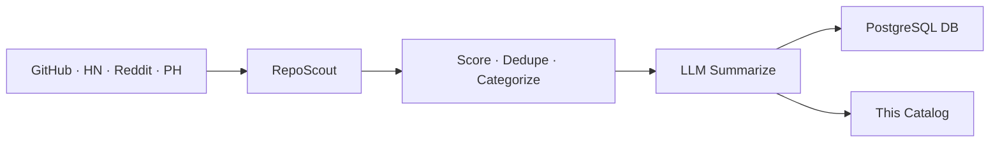

<div align="center">

<picture>
  <source media="(prefers-color-scheme: dark)" srcset="./assets/atlasrepo-logo-dark.svg">
  <source media="(prefers-color-scheme: light)" srcset="./assets/atlasrepo-logo.svg">
  
</picture>

# Open Source Catalog

**Discover promising open-source projects and practical community solutions with evidence, not hype.**

[Website](https://atlasrepo.com/) · [Forum](https://forum.atlasrepo.com/) · [Videos & demos](https://www.youtube.com/@ATLASREPO) · [Community solutions](./solutions/)

  

</div>

> RepoScout discovers projects from GitHub, Hacker News, Reddit, and Product Hunt, then refreshes this catalog every 30 minutes. Community solutions are curated separately and do not receive a made-up score.

---

## 🧭 AtlasRepo community solutions

Curated, runnable solutions maintained separately from the auto-scored discovery catalog below.

| Solution | What it solves | Repository | Community |
|---|---|---|---|
| [Music Video Generator](./solutions/music-video/) | Generate instrumental tracks or a one-hour same-genre playlist video, monitor progress in a browser, and prepare a private Postiz draft | [Arnon-hs/music-video](https://github.com/Arnon-hs/music-video) | AtlasRepo |
| [Codex Watch Bridge](./solutions/codex-watch-bridge/) | Run and monitor real Codex tasks from an Apple Watch through a Mac bridge | [kirbudilov01/codex-watch-bridge](https://github.com/kirbudilov01/codex-watch-bridge) | Community partner · [@kirbudilov01](https://github.com/kirbudilov01) |

[Browse all community solutions →](./solutions/)

## 📊 At a glance

| | |
|---|---|
| 🗂️ **Total projects** | **160** |
| 📁 **Categories** | **15** |
| 🔄 **Auto-sync** | every 30 min via GitHub Actions |
| 🧠 **Summaries** | LLM-generated (OpenRouter · OpenAI · Anthropic · Gemini · Groq · Z.AI) |

## 🗂️ Categories

| Category | Projects | |
|---|---|---|
| 🤖 **AI/ML** | 53 | [Browse →](./aiml/) |
| 📦 **Misc** | 23 | [Browse →](./misc/) |
| 🏷️ **Mcp** | 16 | [Browse →](./mcp/) |
| 🎨 **Frontend** | 15 | [Browse →](./frontend/) |
| 🧩 **Orchestration** | 15 | [Browse →](./orchestration/) |
| 📊 **Data** | 9 | [Browse →](./data/) |
| ⚙️ **Backend** | 9 | [Browse →](./backend/) |
| 📱 **Mobile** | 7 | [Browse →](./mobile/) |
| 🏷️ **Automation** | 4 | [Browse →](./automation/) |
| 🚀 **DevOps & Infra** | 2 | [Browse →](./devopsinfra/) |
| 🔧 **DevTools** | 2 | [Browse →](./devtools/) |
| ⛓️ **Crypto** | 2 | [Browse →](./crypto/) |
| 🔐 **Security** | 1 | [Browse →](./security/) |
| ✨ **Design** | 1 | [Browse →](./design/) |
| 💳 **Payments** | 1 | [Browse →](./payments/) |

## 🔥 Top 10 by score

| # | Project | Stars | Category |
|---|---|---|---|
| 1 | [google-gemini/gemini-cli](./mcp/google-gemini-gemini-cli.md) | ⭐ 106k | Mcp |
| 2 | [sickn33/agentic-awesome-skills](./orchestration/sickn33-agentic-awesome-skills.md) | ⭐ 43.1k | Orchestration |
| 3 | [headroomlabs-ai/headroom](./orchestration/headroomlabs-ai-headroom.md) | ⭐ 59k | Orchestration |
| 4 | [n8n-io/n8n](./mcp/n8n-io-n8n.md) | ⭐ 196.3k | Mcp |
| 5 | [BerriAI/litellm](./orchestration/berriai-litellm.md) | ⭐ 53.5k | Orchestration |
| 6 | [IBM/mcp-context-forge](./mcp/ibm-mcp-context-forge.md) | ⭐ 4.1k | Mcp |
| 7 | [mcp-use/mcp-use](./mcp/mcp-use-mcp-use.md) | ⭐ 10.3k | Mcp |
| 8 | [strands-agents/harness-sdk](./orchestration/strands-agents-harness-sdk.md) | ⭐ 6.6k | Orchestration |
| 9 | [google/adk-python](./orchestration/google-adk-python.md) | ⭐ 20.6k | Orchestration |
| 10 | [archestra-ai/archestra](./mcp/archestra-ai-archestra.md) | ⭐ 4k | Mcp |

## 🚀 How it works


```mermaid
graph LR
  A[GitHub · HN · Reddit · PH] --> B[RepoScout]
  B --> C[Score · Dedupe · Categorize]
  C --> D[LLM Summarize]
  D --> E[PostgreSQL DB]
  D --> F[This Catalog]
```

1. **Discover** — 4 sources pulled in parallel
2. **Score** — weighted: usefulness, quality, integration, production readiness, outlook, adoption
3. **Categorize** — rule-based tagging across product domains, integrations, MCP, RAG, automation and infrastructure
4. **Summarize** — concise RU/EN/ZH summaries via LLM with deterministic fallback
5. **Sync** — markdown committed here, metadata upserted to PostgreSQL

## 🛠️ Self-host

```bash
git clone https://github.com/kirbudilov01/reposearchengine
cp .env.example .env
# Set LLM_PROVIDER, CATALOG_REPO_PATH, DATABASE_URL, ...
npm install && npm start
```

Supports cloud LLM providers (OpenAI · Anthropic · OpenRouter · Gemini · Groq · Z.AI).

## 📦 Data format

- [`index.json`](./index.json) — full catalog sorted by score
- `<category>/README.md` — category index with ranked table
- `<category>/<owner>-<name>.md` — per-repo card with stats, topics, summary

## 📜 License

MIT (metadata). Each linked repository retains its own license.

---

<sub>Part of [AtlasRepo](https://atlasrepo.com/) · Catalog maintained automatically by RepoScout · Community solutions reviewed separately</sub>
