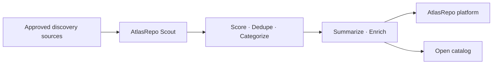

# AtlasRepo Open Source Catalog

Find the best open-source way to solve any task — for you or your AI agent.

[Explore AtlasRepo](https://atlasrepo.com) · [Documentation](https://atlasrepo.com/docs) · [Agent integrations](https://github.com/Arnon-hs/atlasrepo-skills) · [Machine-readable index](./index.json)

> A living, auto-curated catalog of open-source projects, enriched with practical summaries, categories, quality signals and transparent scoring. Built by [AtlasRepo Scout](https://github.com/Arnon-hs/reposearchengine).

## Purpose

This repository turns a fast-moving open-source ecosystem into a browsable and machine-readable decision layer. Use it to discover candidates, compare practical fit and give coding agents grounded starting points before deeper technical, security and license review.

## At a glance

| | |
|---|---|
| **Projects** | **32,904** |
| **Categories** | **44** |
| **Refresh** | Continuously maintained by AtlasRepo Scout |
| **Metadata** | Repository signals, multilingual summaries and practical evaluations |

## Browse the catalog

| Category | Projects | |
|---|---|---|
| 📦 **Misc** | 7674 | [Browse →](./misc/) |
| 🤖 **AI/ML** | 7657 | [Browse →](./aiml/) |
| 🎨 **Frontend** | 2538 | [Browse →](./frontend/) |
| 🏷️ **Mcp** | 2527 | [Browse →](./mcp/) |
| 🧩 **Orchestration** | 2306 | [Browse →](./orchestration/) |
| 🏷️ **Automation** | 1676 | [Browse →](./automation/) |
| 🔧 **DevTools** | 1547 | [Browse →](./devtools/) |
| ⚙️ **Backend** | 1176 | [Browse →](./backend/) |
| ⛓️ **Crypto** | 990 | [Browse →](./crypto/) |
| 🏷️ **Knowledgerag** | 920 | [Browse →](./knowledgerag/) |
| 🏷️ **Database** | 793 | [Browse →](./database/) |
| 📊 **Data** | 641 | [Browse →](./data/) |
| 📱 **Mobile** | 409 | [Browse →](./mobile/) |
| 💳 **Payments** | 351 | [Browse →](./payments/) |
| 📈 **Trading** | 327 | [Browse →](./trading/) |
| 🚀 **DevOps & Infra** | 296 | [Browse →](./devopsinfra/) |
| 🔐 **Security** | 236 | [Browse →](./security/) |
| 🏷️ **Observability** | 193 | [Browse →](./observability/) |
| 🏷️ **Education** | 151 | [Browse →](./education/) |
| ✨ **Design** | 121 | [Browse →](./design/) |
| 🏷️ **Templates** | 81 | [Browse →](./templates/) |
| 🏷️ **Video-editing** | 80 | [Browse →](./video-editing/) |
| 🏷️ **Marketing** | 53 | [Browse →](./marketing/) |
| 🏷️ **Vertical-video** | 52 | [Browse →](./vertical-video/) |
| 🎯 **Product** | 47 | [Browse →](./product/) |
| 🏷️ **Content-creation** | 39 | [Browse →](./content-creation/) |
| 🏷️ **Python** | 2 | [Browse →](./python/) |
| 🏷️ **Self-hosting** | 2 | [Browse →](./self-hosting/) |
| 🏷️ **Image-processing** | 2 | [Browse →](./image-processing/) |
| 🏷️ **Coding-agent** | 2 | [Browse →](./coding-agent/) |
| 🏷️ **Ai** | 2 | [Browse →](./ai/) |
| 🏷️ **Ai-video** | 1 | [Browse →](./ai-video/) |
| 🏷️ **Lead-generation** | 1 | [Browse →](./lead-generation/) |
| 🏷️ **Ai-coding-agents** | 1 | [Browse →](./ai-coding-agents/) |
| 🏷️ **Nlp** | 1 | [Browse →](./nlp/) |
| 🏷️ **Linkedin** | 1 | [Browse →](./linkedin/) |
| 🏷️ **Web-scraping** | 1 | [Browse →](./web-scraping/) |
| 🏷️ **Aws** | 1 | [Browse →](./aws/) |
| 🏷️ **Korean** | 1 | [Browse →](./korean/) |
| 🏷️ **Llm** | 1 | [Browse →](./llm/) |
| 🏷️ **Developer-tools** | 1 | [Browse →](./developer-tools/) |
| 🏷️ **Windows** | 1 | [Browse →](./windows/) |
| 🏷️ **Ai-coding-agent** | 1 | [Browse →](./ai-coding-agent/) |
| 🏷️ **Open-source** | 1 | [Browse →](./open-source/) |

## Top projects by score

| # | Project | Stars | Category |
|---|---|---|---|
| 1 | [sickn33/agentic-awesome-skills](./orchestration/sickn33-agentic-awesome-skills.md) | ⭐ 42.6k | Orchestration |
| 2 | [Panniantong/Agent-Reach](./mcp/panniantong-agent-reach.md) | ⭐ 44.7k | Mcp |
| 3 | [headroomlabs-ai/headroom](./orchestration/headroomlabs-ai-headroom.md) | ⭐ 46.8k | Orchestration |
| 4 | [xberg-io/xberg](./mcp/xberg-io-xberg.md) | ⭐ 8.5k | Mcp |
| 5 | [xberg-io/kreuzberg](./mcp/xberg-io-kreuzberg.md) | ⭐ 8.5k | Mcp |
| 6 | [diegosouzapw/OmniRoute](./mcp/diegosouzapw-omniroute.md) | ⭐ 6.7k | Mcp |
| 7 | [langgenius/dify](./orchestration/langgenius-dify.md) | ⭐ 146.2k | Orchestration |
| 8 | [zeromicro/go-zero](./aiml/zeromicro-go-zero.md) | ⭐ 33.2k | AI/ML |
| 9 | [wasp-lang/open-saas](./payments/wasp-lang-open-saas.md) | ⭐ 14.9k | Payments |
| 10 | [firerpa/lamda](./mcp/firerpa-lamda.md) | ⭐ 7.9k | Mcp |

## What each entry includes

| Signal | Why it matters |
|---|---|
| Repository activity | Stars, forks, language and last update provide a quick health snapshot |
| Practical summary | Concise English, Russian and Chinese context for faster evaluation |
| Fit and readiness | Use cases, integration notes, quality signals and production-readiness notes |
| Transparent score | A directional breakdown across usefulness, quality, integration, readiness, outlook and adoption |

## How it works

```mermaid
graph LR
  A[Approved discovery sources] --> B[AtlasRepo Scout]
  B --> C[Score · Dedupe · Categorize]
  C --> D[Summarize · Enrich]
  D --> E[AtlasRepo platform]
  D --> F[Open catalog]
```

1. **Discover** — collect candidates from approved public sources.
2. **Normalize** — deduplicate repositories and standardize metadata.
3. **Evaluate** — score practical value, quality, integration fit, readiness, outlook and adoption.
4. **Enrich** — add categories, summaries, use cases, quality signals and risk notes.
5. **Publish** — update the AtlasRepo platform and this open catalog.

## Use with AI agents

The catalog supports direct browsing and grounded agent workflows. [AtlasRepo Skills](https://github.com/Arnon-hs/atlasrepo-skills) adds read-only search and recommendation flows for compatible coding agents; the hosted [AtlasRepo MCP server](https://mcp.atlasrepo.com/mcp) exposes bounded catalog tools to compatible clients.

## Data contract

- [`index.json`](./index.json) — machine-readable entry point, currently a compact manifest for the sharded catalog.
- `data/repos-*.json` — catalog shards sorted by score, with up to 1,000 projects per shard.
- `<category>/README.md` — ranked category index.
- `<category>/<owner>-<name>.md` — human-readable project card with evidence and evaluation metadata.

## Trust boundary

Catalog records, scores, summaries and external installation commands are discovery aids, not endorsements or security guarantees. Verify repository ownership, current maintenance, dependencies, license compatibility and installation steps before adoption.

## License

MIT for this repository's catalog metadata. See [LICENSE](./LICENSE). Linked repositories remain governed by their respective licenses.
