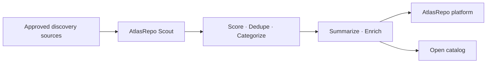

# AtlasRepo Open Source Catalog

**Evidence-backed open-source search for coding agents.**

[Documentation](https://atlasrepo.com/docs) · [Hosted MCP](https://mcp.atlasrepo.com/mcp) · [npm](https://www.npmjs.com/package/atlasrepo-mcp) · [Skills](https://github.com/Arnon-hs/atlasrepo-skills)

> A living, auto-curated catalog of open-source projects, enriched with practical summaries, categories, quality signals and transparent scoring.

## Purpose

This repository turns a fast-moving open-source ecosystem into a browsable and machine-readable decision layer. Use it to discover candidates, compare practical fit and give coding agents grounded starting points before deeper technical, security and license review.

## At a glance

| | |
|---|---|
| **Projects** | **34597** |
| **Categories** | **36** |
| **Refresh** | Continuously maintained by AtlasRepo Scout |
| **Metadata** | Repository signals, multilingual summaries and practical evaluations |

## Browse the catalog

| Category | Projects | |
|---|---|---|
| 📦 **Misc** | 12866 | [Browse →](./misc/) |
| 🤖 **AI/ML** | 4038 | [Browse →](./aiml/) |
| 🏷️ **Mcp** | 2567 | [Browse →](./mcp/) |
| 🧩 **Orchestration** | 2207 | [Browse →](./orchestration/) |
| 🔧 **DevTools** | 1535 | [Browse →](./devtools/) |
| 🏷️ **Automation** | 1262 | [Browse →](./automation/) |
| ⚙️ **Backend** | 895 | [Browse →](./backend/) |
| 🎨 **Frontend** | 850 | [Browse →](./frontend/) |
| ⛓️ **Crypto** | 759 | [Browse →](./crypto/) |
| 🏷️ **Documents** | 604 | [Browse →](./documents/) |
| 🏷️ **Networking** | 597 | [Browse →](./networking/) |
| 🏷️ **Knowledgerag** | 564 | [Browse →](./knowledgerag/) |
| 📱 **Mobile** | 556 | [Browse →](./mobile/) |
| 🏷️ **Cloud--storage** | 551 | [Browse →](./cloud--storage/) |
| 🚀 **DevOps & Infra** | 459 | [Browse →](./devopsinfra/) |
| 🏷️ **Database** | 458 | [Browse →](./database/) |
| 🏷️ **Templates** | 421 | [Browse →](./templates/) |
| 🔐 **Security** | 372 | [Browse →](./security/) |
| 🏷️ **Communication** | 366 | [Browse →](./communication/) |
| 🏷️ **Video-editing** | 330 | [Browse →](./video-editing/) |
| 📊 **Data** | 319 | [Browse →](./data/) |
| 🏷️ **Games--graphics** | 312 | [Browse →](./games--graphics/) |
| 💳 **Payments** | 311 | [Browse →](./payments/) |
| 🏷️ **Productivity** | 298 | [Browse →](./productivity/) |
| 🏷️ **Observability** | 260 | [Browse →](./observability/) |
| 🏷️ **Libraries--sdks** | 238 | [Browse →](./libraries--sdks/) |
| 📈 **Trading** | 187 | [Browse →](./trading/) |
| ✨ **Design** | 144 | [Browse →](./design/) |
| 🏷️ **Content-creation** | 126 | [Browse →](./content-creation/) |
| 🏷️ **Vertical-video** | 77 | [Browse →](./vertical-video/) |
| 🏷️ **Education** | 29 | [Browse →](./education/) |
| 🏷️ **Marketing** | 28 | [Browse →](./marketing/) |
| 🎯 **Product** | 6 | [Browse →](./product/) |
| 🏷️ **Ai-integration** | 3 | [Browse →](./ai-integration/) |
| 🏷️ **Scheduler** | 1 | [Browse →](./scheduler/) |
| 🏷️ **Ai** | 1 | [Browse →](./ai/) |

## Top projects by score

| # | Project | Stars | Category |
|---|---|---|---|
| 1 | [sickn33/agentic-awesome-skills](./orchestration/sickn33-agentic-awesome-skills.md) | ⭐ 42.6k | Orchestration |
| 2 | [Panniantong/Agent-Reach](./mcp/panniantong-agent-reach.md) | ⭐ 44.7k | Mcp |
| 3 | [headroomlabs-ai/headroom](./orchestration/headroomlabs-ai-headroom.md) | ⭐ 46.8k | Orchestration |
| 4 | [wasp-lang/open-saas](./templates/wasp-lang-open-saas.md) | ⭐ 14.9k | Templates |
| 5 | [xberg-io/xberg](./mcp/xberg-io-xberg.md) | ⭐ 8.5k | Mcp |
| 6 | [xberg-io/kreuzberg](./mcp/xberg-io-kreuzberg.md) | ⭐ 8.5k | Mcp |
| 7 | [diegosouzapw/OmniRoute](./mcp/diegosouzapw-omniroute.md) | ⭐ 6.7k | Mcp |
| 8 | [langgenius/dify](./orchestration/langgenius-dify.md) | ⭐ 146.2k | Orchestration |
| 9 | [zeromicro/go-zero](./aiml/zeromicro-go-zero.md) | ⭐ 33.2k | AI/ML |
| 10 | [firerpa/lamda](./mcp/firerpa-lamda.md) | ⭐ 7.9k | Mcp |

## What each entry includes

| Signal | Why it matters |
|---|---|
| Repository activity | Stars, forks, language and last update provide a quick health snapshot |
| Practical summary | Concise English, Russian and Chinese context for faster evaluation |
| Fit and readiness | Use cases, integration notes, quality signals and production-readiness notes |
| Transparent score | A directional breakdown across usefulness, quality, integration, readiness, outlook and adoption |

## How it works


```mermaid
graph LR
  A[Approved discovery sources] --> B[AtlasRepo Scout]
  B --> C[Score · Dedupe · Categorize]
  C --> D[Summarize · Enrich]
  D --> E[AtlasRepo platform]
  D --> F[Open catalog]
```

1. **Discover** — collect candidates from approved public sources.
2. **Normalize** — deduplicate repositories and standardize metadata.
3. **Evaluate** — score practical value, quality, integration fit, readiness, outlook and adoption.
4. **Enrich** — add categories, summaries, use cases, quality signals and risk notes.
5. **Publish** — update the AtlasRepo platform and this open catalog.

## Install

### ChatGPT — hosted MCP plugin

1. Open **Settings → Security and login** and enable **Developer mode**.
2. Open [ChatGPT Plugins](https://chatgpt.com/#settings/Plugins), select **+**, and create a connection named `AtlasRepo`.
3. Set the MCP endpoint to `https://mcp.atlasrepo.com/mcp`, create the connection, and review the discovered read-only tools.

Developer mode availability depends on your account and workspace policy. See the [official OpenAI connection guide](https://developers.openai.com/plugins/deploy/connect-chatgpt).

### Claude Code

Plugin:

```text
/plugin marketplace add Arnon-hs/atlasrepo-skills
/plugin install atlasrepo@atlasrepo-skills
/reload-plugins
```

Hosted MCP only:

```bash
claude mcp add --transport http atlasrepo https://mcp.atlasrepo.com/mcp
```

Local npm MCP instead:

```bash
claude mcp add --transport stdio atlasrepo -- npx -y atlasrepo-mcp
```

Browse the [AtlasRepo Skills repository](https://github.com/Arnon-hs/atlasrepo-skills) or inspect the [`scout-rest-api` skill source](https://github.com/Arnon-hs/atlasrepo-skills/tree/main/plugins/atlasrepo/skills/scout-rest-api). Claude plugin commands follow the [official marketplace flow](https://code.claude.com/docs/en/discover-plugins); MCP-only commands follow the [official Claude MCP syntax](https://code.claude.com/docs/en/mcp).

## Data contract

- [`index.json`](./index.json) — machine-readable entry point, either a complete sorted index or a shard manifest for large snapshots.
- `data/repos-*.json` — machine-readable catalog shards when sharding is enabled.
- `<category>/README.md` — ranked category index.
- `<category>/<owner>-<name>.md` — human-readable project card with evidence and evaluation metadata.

## Trust boundary

Catalog records, scores, summaries and external installation commands are discovery aids, not endorsements or security guarantees. Verify repository ownership, current maintenance, dependencies, license compatibility and installation steps before adoption.

## License

MIT for this repository's catalog metadata. See [LICENSE](./LICENSE). Linked repositories remain governed by their respective licenses.
