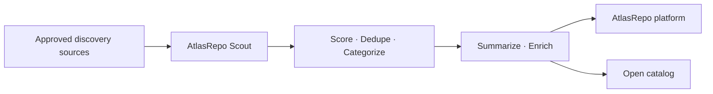

# AtlasRepo Open Source Catalog

**Evidence-backed open-source search for coding agents.**

[Documentation](https://atlasrepo.com/docs) · [Hosted MCP](https://mcp.atlasrepo.com/mcp) · [npm](https://www.npmjs.com/package/atlasrepo-mcp) · [Skills](https://github.com/Arnon-hs/atlasrepo-skills)

> A living, auto-curated catalog of open-source projects, enriched with practical summaries, categories, quality signals and transparent scoring.

## Purpose

This repository turns a fast-moving open-source ecosystem into a browsable and machine-readable decision layer. Use it to discover candidates, compare practical fit and give coding agents grounded starting points before deeper technical, security and license review.

## At a glance

| | |
|---|---|
| **Projects** | **43336** |
| **Categories** | **520** |
| **Refresh** | Continuously maintained by AtlasRepo Scout |
| **Metadata** | Repository signals, multilingual summaries and practical evaluations |

## Browse the catalog

| Category | Projects | |
|---|---|---|
| 📦 **Misc** | 17459 | [Browse →](./misc/) |
| 🤖 **AI/ML** | 4623 | [Browse →](./aiml/) |
| 🏷️ **Mcp** | 2902 | [Browse →](./mcp/) |
| 🧩 **Orchestration** | 2408 | [Browse →](./orchestration/) |
| 🔧 **DevTools** | 1603 | [Browse →](./devtools/) |
| 🏷️ **Automation** | 1490 | [Browse →](./automation/) |
| ⚙️ **Backend** | 957 | [Browse →](./backend/) |
| 🎨 **Frontend** | 902 | [Browse →](./frontend/) |
| ⛓️ **Crypto** | 813 | [Browse →](./crypto/) |
| 🏷️ **Documents** | 719 | [Browse →](./documents/) |
| 🏷️ **Networking** | 664 | [Browse →](./networking/) |
| 📱 **Mobile** | 664 | [Browse →](./mobile/) |
| 🏷️ **Knowledgerag** | 627 | [Browse →](./knowledgerag/) |
| 🏷️ **Cloud--storage** | 621 | [Browse →](./cloud--storage/) |
| 🏷️ **Database** | 561 | [Browse →](./database/) |
| 🏷️ **Video-editing** | 559 | [Browse →](./video-editing/) |
| 🚀 **DevOps & Infra** | 527 | [Browse →](./devopsinfra/) |
| 🏷️ **Templates** | 480 | [Browse →](./templates/) |
| 🔐 **Security** | 458 | [Browse →](./security/) |
| 🏷️ **Communication** | 453 | [Browse →](./communication/) |
| 💳 **Payments** | 373 | [Browse →](./payments/) |
| 🏷️ **Games--graphics** | 347 | [Browse →](./games--graphics/) |
| 📊 **Data** | 344 | [Browse →](./data/) |
| 🏷️ **Productivity** | 339 | [Browse →](./productivity/) |
| 🏷️ **Observability** | 310 | [Browse →](./observability/) |
| 🏷️ **Libraries--sdks** | 271 | [Browse →](./libraries--sdks/) |
| 📈 **Trading** | 221 | [Browse →](./trading/) |
| ✨ **Design** | 186 | [Browse →](./design/) |
| 🏷️ **Content-creation** | 155 | [Browse →](./content-creation/) |
| 🏷️ **Vertical-video** | 141 | [Browse →](./vertical-video/) |
| 🏷️ **Ai** | 123 | [Browse →](./ai/) |
| 🏷️ **Marketing** | 36 | [Browse →](./marketing/) |
| 🏷️ **Education** | 33 | [Browse →](./education/) |
| 🏷️ **Open-source** | 32 | [Browse →](./open-source/) |
| 🏷️ **Offline** | 31 | [Browse →](./offline/) |
| 🏷️ **Ai-agents** | 30 | [Browse →](./ai-agents/) |
| 🏷️ **Local-ai** | 27 | [Browse →](./local-ai/) |
| 🏷️ **Privacy** | 23 | [Browse →](./privacy/) |
| 🏷️ **Llm** | 20 | [Browse →](./llm/) |
| 🏷️ **Local-first** | 19 | [Browse →](./local-first/) |
| 🏷️ **Local-llm** | 15 | [Browse →](./local-llm/) |
| 🏷️ **Freelance** | 14 | [Browse →](./freelance/) |
| 🏷️ **Rust** | 11 | [Browse →](./rust/) |
| 🏷️ **Offline-first** | 11 | [Browse →](./offline-first/) |
| 🏷️ **Ci** | 9 | [Browse →](./ci/) |
| 🏷️ **Macos** | 9 | [Browse →](./macos/) |
| 🏷️ **Claude-code** | 9 | [Browse →](./claude-code/) |
| 🏷️ **Whatsapp** | 8 | [Browse →](./whatsapp/) |
| 🏷️ **Self-hosting** | 8 | [Browse →](./self-hosting/) |
| 🎯 **Product** | 7 | [Browse →](./product/) |
| 🏷️ **N8n** | 7 | [Browse →](./n8n/) |
| 🏷️ **Android** | 6 | [Browse →](./android/) |
| 🏷️ **Ai-agent** | 6 | [Browse →](./ai-agent/) |
| 🏷️ **Git** | 6 | [Browse →](./git/) |
| 🏷️ **Python** | 6 | [Browse →](./python/) |
| 🏷️ **Edge-ai** | 6 | [Browse →](./edge-ai/) |
| 🏷️ **Terminal** | 5 | [Browse →](./terminal/) |
| 🏷️ **Coding-agents** | 5 | [Browse →](./coding-agents/) |
| 🏷️ **Self-hosted** | 5 | [Browse →](./self-hosted/) |
| 🏷️ **Kubernetes** | 5 | [Browse →](./kubernetes/) |
| 🏷️ **Aws** | 5 | [Browse →](./aws/) |
| 🏷️ **Windows** | 4 | [Browse →](./windows/) |
| 🏷️ **Agent** | 4 | [Browse →](./agent/) |
| 🏷️ **Api** | 4 | [Browse →](./api/) |
| 🏷️ **Documentation** | 4 | [Browse →](./documentation/) |
| 🏷️ **Ai-coding** | 4 | [Browse →](./ai-coding/) |
| 🏷️ **Offline-ai** | 4 | [Browse →](./offline-ai/) |
| 🏷️ **Php** | 4 | [Browse →](./php/) |
| 🏷️ **Docker** | 4 | [Browse →](./docker/) |
| 🏷️ **Open-source-ai** | 4 | [Browse →](./open-source-ai/) |
| 🏷️ **Devchallenge** | 4 | [Browse →](./devchallenge/) |
| 🏷️ **Edge-computing** | 4 | [Browse →](./edge-computing/) |
| 🏷️ **Sanity** | 4 | [Browse →](./sanity/) |
| 🏷️ **Serverless** | 3 | [Browse →](./serverless/) |
| 🏷️ **Claude** | 3 | [Browse →](./claude/) |
| 🏷️ **Email** | 3 | [Browse →](./email/) |
| 🏷️ **Secret-scanning** | 3 | [Browse →](./secret-scanning/) |
| 🏷️ **Linux** | 3 | [Browse →](./linux/) |
| 🌐 **Open Source** | 3 | [Browse →](./opensource/) |
| 🏷️ **Asr** | 3 | [Browse →](./asr/) |
| 🏷️ **Web-scraping** | 3 | [Browse →](./web-scraping/) |
| 🏷️ **Ios** | 3 | [Browse →](./ios/) |
| 🏷️ **Browser-automation** | 3 | [Browse →](./browser-automation/) |
| 🏷️ **Ai-security** | 3 | [Browse →](./ai-security/) |
| 🏷️ **Hacktoberfest** | 3 | [Browse →](./hacktoberfest/) |
| 🏷️ **Nextjs** | 3 | [Browse →](./nextjs/) |
| 🏷️ **Chrome-extension** | 3 | [Browse →](./chrome-extension/) |
| 🏷️ **Cli** | 3 | [Browse →](./cli/) |
| 🏷️ **Restaurant** | 3 | [Browse →](./restaurant/) |
| 🏷️ **Multi-agent** | 3 | [Browse →](./multi-agent/) |
| 🏷️ **E-commerce** | 3 | [Browse →](./e-commerce/) |
| 🏷️ **Agentic-workflows** | 3 | [Browse →](./agentic-workflows/) |
| 🏷️ **Ecommerce** | 3 | [Browse →](./ecommerce/) |
| 🏷️ **Github-actions** | 3 | [Browse →](./github-actions/) |
| 🏷️ **Cloudflare** | 3 | [Browse →](./cloudflare/) |
| 🏷️ **Air-quality** | 3 | [Browse →](./air-quality/) |
| 🏷️ **Openapi** | 3 | [Browse →](./openapi/) |
| 🏷️ **Hackathon** | 3 | [Browse →](./hackathon/) |
| 🏷️ **Devsecops** | 3 | [Browse →](./devsecops/) |
| 🏷️ **Home-automation** | 3 | [Browse →](./home-automation/) |
| 🏷️ **Escrow** | 3 | [Browse →](./escrow/) |
| 🏷️ **Yolo** | 2 | [Browse →](./yolo/) |
| 🏷️ **Filesharing** | 2 | [Browse →](./filesharing/) |
| 🏷️ **Shared-memory** | 2 | [Browse →](./shared-memory/) |
| 🏷️ **Static-analysis** | 2 | [Browse →](./static-analysis/) |
| 🏷️ **Legal** | 2 | [Browse →](./legal/) |
| 🏷️ **Image-generation** | 2 | [Browse →](./image-generation/) |
| 🏷️ **Local-inference** | 2 | [Browse →](./local-inference/) |
| 🏷️ **Encryption** | 2 | [Browse →](./encryption/) |
| 🏷️ **Pst** | 2 | [Browse →](./pst/) |
| 🏷️ **Nestjs** | 2 | [Browse →](./nestjs/) |
| 🏷️ **Invoice-processing** | 2 | [Browse →](./invoice-processing/) |
| 🏷️ **Laravel** | 2 | [Browse →](./laravel/) |
| 🏷️ **Ocr** | 2 | [Browse →](./ocr/) |
| 🏷️ **File-management** | 2 | [Browse →](./file-management/) |
| 🏷️ **Testing** | 2 | [Browse →](./testing/) |
| 🏷️ **Fileorganizer** | 2 | [Browse →](./fileorganizer/) |
| 🏷️ **Rag** | 2 | [Browse →](./rag/) |
| 🏷️ **Fitness** | 2 | [Browse →](./fitness/) |
| 🏷️ **File-organization** | 2 | [Browse →](./file-organization/) |
| 🏷️ **Screenshot-management** | 2 | [Browse →](./screenshot-management/) |
| 🏷️ **Telegram** | 2 | [Browse →](./telegram/) |
| 🏷️ **Desktop** | 2 | [Browse →](./desktop/) |
| 🏷️ **Postgres** | 2 | [Browse →](./postgres/) |
| 🏷️ **Raspberry-pi** | 2 | [Browse →](./raspberry-pi/) |
| 🏷️ **Web** | 2 | [Browse →](./web/) |
| 🏷️ **Flaky-tests** | 2 | [Browse →](./flaky-tests/) |
| 🏷️ **Matrixos** | 2 | [Browse →](./matrixos/) |
| 🏷️ **Github-copilot** | 2 | [Browse →](./github-copilot/) |
| 🏷️ **Cybersecurity** | 2 | [Browse →](./cybersecurity/) |
| 🏷️ **Secondhand** | 2 | [Browse →](./secondhand/) |
| 🏷️ **X402** | 2 | [Browse →](./x402/) |
| 🏷️ **Allergen-labeling** | 2 | [Browse →](./allergen-labeling/) |
| 🏷️ **Rails** | 2 | [Browse →](./rails/) |
| 🏷️ **Llamaindex** | 2 | [Browse →](./llamaindex/) |
| 🏷️ **Minecraft** | 2 | [Browse →](./minecraft/) |
| 🏷️ **Ai-code-review** | 2 | [Browse →](./ai-code-review/) |
| 🏷️ **Invoice-generation** | 2 | [Browse →](./invoice-generation/) |
| 🏷️ **Ui** | 2 | [Browse →](./ui/) |
| 🏷️ **Digital-products** | 2 | [Browse →](./digital-products/) |
| 🏷️ **Embedding** | 2 | [Browse →](./embedding/) |
| 🏷️ **On-device-ai** | 2 | [Browse →](./on-device-ai/) |
| 🏷️ **Open-weight-model** | 2 | [Browse →](./open-weight-model/) |
| 🏷️ **Ai-ops** | 2 | [Browse →](./ai-ops/) |
| 🏷️ **Benchmark** | 2 | [Browse →](./benchmark/) |
| 🏷️ **Outdoor** | 2 | [Browse →](./outdoor/) |
| 🏷️ **Desktop-automation** | 2 | [Browse →](./desktop-automation/) |
| 🏷️ **Node** | 2 | [Browse →](./node/) |
| 🏷️ **Net** | 2 | [Browse →](./net/) |
| 🏷️ **Stylometry** | 2 | [Browse →](./stylometry/) |
| 🏷️ **Investment** | 2 | [Browse →](./investment/) |
| 🏷️ **React-native** | 2 | [Browse →](./react-native/) |
| 🏷️ **Landslide** | 2 | [Browse →](./landslide/) |
| 🏷️ **Webgpu** | 2 | [Browse →](./webgpu/) |
| 🏷️ **Bug-bounty** | 2 | [Browse →](./bug-bounty/) |
| 🏷️ **Career-advice** | 2 | [Browse →](./career-advice/) |
| 🏷️ **Showdev** | 2 | [Browse →](./showdev/) |
| 🏷️ **Ai-safety** | 2 | [Browse →](./ai-safety/) |
| 🏷️ **Angular** | 2 | [Browse →](./angular/) |
| 🏷️ **System-one** | 2 | [Browse →](./system-one/) |
| 🏷️ **Cloud-native** | 2 | [Browse →](./cloud-native/) |
| 🏷️ **Local-models** | 2 | [Browse →](./local-models/) |
| 🏷️ **Video-generation** | 2 | [Browse →](./video-generation/) |
| 🏷️ **Resume** | 2 | [Browse →](./resume/) |
| 🏷️ **Embedded** | 2 | [Browse →](./embedded/) |
| 🏷️ **Agent-orchestration** | 2 | [Browse →](./agent-orchestration/) |
| 🏷️ **Free-tools** | 2 | [Browse →](./free-tools/) |
| 🏷️ **Monorepo** | 2 | [Browse →](./monorepo/) |
| 🏷️ **Apify** | 2 | [Browse →](./apify/) |
| 🏷️ **Autonomous-agent** | 2 | [Browse →](./autonomous-agent/) |
| 🏷️ **Npm** | 2 | [Browse →](./npm/) |
| 🏷️ **Ai-integration** | 2 | [Browse →](./ai-integration/) |
| 🏷️ **Html** | 1 | [Browse →](./html/) |
| 🏷️ **Pos** | 1 | [Browse →](./pos/) |
| 🏷️ **Ebook-reader** | 1 | [Browse →](./ebook-reader/) |
| 🏷️ **Da-de-los-muertos** | 1 | [Browse →](./da-de-los-muertos/) |
| 🏷️ **Focus** | 1 | [Browse →](./focus/) |
| 🏷️ **Agentic-coding** | 1 | [Browse →](./agentic-coding/) |
| 🏷️ **Privatebin** | 1 | [Browse →](./privatebin/) |
| 🏷️ **Browser-management** | 1 | [Browse →](./browser-management/) |
| 🏷️ **Real-estate** | 1 | [Browse →](./real-estate/) |
| 🏷️ **Visual-workflow** | 1 | [Browse →](./visual-workflow/) |
| 🏷️ **Crashanalysis** | 1 | [Browse →](./crashanalysis/) |
| 🏷️ **Mail** | 1 | [Browse →](./mail/) |
| 🏷️ **Ted** | 1 | [Browse →](./ted/) |
| 🏷️ **Zsh** | 1 | [Browse →](./zsh/) |
| 🏷️ **Wayback-machine** | 1 | [Browse →](./wayback-machine/) |
| 🏷️ **Agent-skill-security** | 1 | [Browse →](./agent-skill-security/) |
| 🏷️ **Email-validation** | 1 | [Browse →](./email-validation/) |
| 🏷️ **Fine-tuning** | 1 | [Browse →](./fine-tuning/) |
| 🏷️ **Cicd** | 1 | [Browse →](./cicd/) |
| 🏷️ **Ipad** | 1 | [Browse →](./ipad/) |
| 🏷️ **Logistics** | 1 | [Browse →](./logistics/) |
| 🏷️ **Bun** | 1 | [Browse →](./bun/) |
| 🏷️ **Osint** | 1 | [Browse →](./osint/) |
| 🏷️ **Ontology** | 1 | [Browse →](./ontology/) |
| 🏷️ **Django** | 1 | [Browse →](./django/) |
| 🏷️ **Deep-learning** | 1 | [Browse →](./deep-learning/) |
| 🏷️ **Webrtc** | 1 | [Browse →](./webrtc/) |
| 🏷️ **Zero-trust** | 1 | [Browse →](./zero-trust/) |
| 🏷️ **Electron** | 1 | [Browse →](./electron/) |
| 🏷️ **Mixture-of-experts** | 1 | [Browse →](./mixture-of-experts/) |
| 🏷️ **Samsung** | 1 | [Browse →](./samsung/) |
| 🏷️ **Openagentforum** | 1 | [Browse →](./openagentforum/) |
| 🏷️ **Newsletter** | 1 | [Browse →](./newsletter/) |
| 🏷️ **Document-analysis** | 1 | [Browse →](./document-analysis/) |
| 🏷️ **Healthcare** | 1 | [Browse →](./healthcare/) |
| 🏷️ **Youtube** | 1 | [Browse →](./youtube/) |
| 🏷️ **Jetpack-compose** | 1 | [Browse →](./jetpack-compose/) |
| 🏷️ **Comfyui** | 1 | [Browse →](./comfyui/) |
| 🏷️ **Android-auto** | 1 | [Browse →](./android-auto/) |
| 🏷️ **Godot** | 1 | [Browse →](./godot/) |
| 🏷️ **Oracle** | 1 | [Browse →](./oracle/) |
| 🏷️ **Website-research** | 1 | [Browse →](./website-research/) |
| 🏷️ **Opentelemetry** | 1 | [Browse →](./opentelemetry/) |
| 🏷️ **Helm** | 1 | [Browse →](./helm/) |
| 🏷️ **Refactor** | 1 | [Browse →](./refactor/) |
| 🏷️ **Neomorphism** | 1 | [Browse →](./neomorphism/) |
| 🏷️ **Electricity** | 1 | [Browse →](./electricity/) |
| 🏷️ **Image-forensics** | 1 | [Browse →](./image-forensics/) |
| 🏷️ **Javascript** | 1 | [Browse →](./javascript/) |
| 🏷️ **Sandbox** | 1 | [Browse →](./sandbox/) |
| 🏷️ **Tiktok** | 1 | [Browse →](./tiktok/) |
| 🏷️ **Cancellation** | 1 | [Browse →](./cancellation/) |
| 🏷️ **Gemma-4** | 1 | [Browse →](./gemma-4/) |
| 🏷️ **Meal-planning** | 1 | [Browse →](./meal-planning/) |
| 🏷️ **Ai-adoption** | 1 | [Browse →](./ai-adoption/) |
| 🏷️ **Contract-review** | 1 | [Browse →](./contract-review/) |
| 🏷️ **Chess** | 1 | [Browse →](./chess/) |
| 🏷️ **Screenshot** | 1 | [Browse →](./screenshot/) |
| 🏷️ **Instagram** | 1 | [Browse →](./instagram/) |
| 🏷️ **Activity-tracking** | 1 | [Browse →](./activity-tracking/) |
| 🏷️ **Local-search** | 1 | [Browse →](./local-search/) |
| 🏷️ **Ai-coding-agents** | 1 | [Browse →](./ai-coding-agents/) |
| 🏷️ **Task-extraction** | 1 | [Browse →](./task-extraction/) |
| 🏷️ **Model-compression** | 1 | [Browse →](./model-compression/) |
| 🏷️ **Voice-context** | 1 | [Browse →](./voice-context/) |
| 🏷️ **Commit-message-generation** | 1 | [Browse →](./commit-message-generation/) |
| 🏷️ **Subscription-tracking** | 1 | [Browse →](./subscription-tracking/) |
| 🏷️ **Peak-finder** | 1 | [Browse →](./peak-finder/) |
| 🏷️ **Steam** | 1 | [Browse →](./steam/) |
| 🏷️ **Linter** | 1 | [Browse →](./linter/) |
| 🏷️ **Voice-control** | 1 | [Browse →](./voice-control/) |
| 🏷️ **Assistant** | 1 | [Browse →](./assistant/) |
| 🏷️ **Digital-clutter** | 1 | [Browse →](./digital-clutter/) |
| 🏷️ **Edtech** | 1 | [Browse →](./edtech/) |
| 🏷️ **Edr** | 1 | [Browse →](./edr/) |
| 🏷️ **Debt-tracking** | 1 | [Browse →](./debt-tracking/) |
| 🏷️ **Machine-learning** | 1 | [Browse →](./machine-learning/) |
| 🏷️ **Standup** | 1 | [Browse →](./standup/) |
| 🏷️ **Excalidraw** | 1 | [Browse →](./excalidraw/) |
| 🏷️ **Browser-game** | 1 | [Browse →](./browser-game/) |
| 🏷️ **Alarm** | 1 | [Browse →](./alarm/) |
| 🏷️ **On-premise** | 1 | [Browse →](./on-premise/) |
| 🏷️ **Ai-detection** | 1 | [Browse →](./ai-detection/) |
| 🏷️ **Slow-productivity** | 1 | [Browse →](./slow-productivity/) |
| 🏷️ **Api-testing** | 1 | [Browse →](./api-testing/) |
| 🏷️ **Sat** | 1 | [Browse →](./sat/) |
| 🏷️ **Openweight-ai** | 1 | [Browse →](./openweight-ai/) |
| 🏷️ **Personal-vault** | 1 | [Browse →](./personal-vault/) |
| 🏷️ **Pixrestore** | 1 | [Browse →](./pixrestore/) |
| 🏷️ **Deepinfer** | 1 | [Browse →](./deepinfer/) |
| 🏷️ **Embeddinggemma2** | 1 | [Browse →](./embeddinggemma2/) |
| 🏷️ **Phishing** | 1 | [Browse →](./phishing/) |
| 🏷️ **Tabular** | 1 | [Browse →](./tabular/) |
| 🏷️ **Podcast** | 1 | [Browse →](./podcast/) |
| 🏷️ **Release-engineering** | 1 | [Browse →](./release-engineering/) |
| 🏷️ **Bash** | 1 | [Browse →](./bash/) |
| 🏷️ **Aiax** | 1 | [Browse →](./aiax/) |
| 🏷️ **Markdown** | 1 | [Browse →](./markdown/) |
| 🏷️ **Bytechef** | 1 | [Browse →](./bytechef/) |
| 🏷️ **Asyncio** | 1 | [Browse →](./asyncio/) |
| 🏷️ **Contract-management** | 1 | [Browse →](./contract-management/) |
| 🏷️ **Data-feeds** | 1 | [Browse →](./data-feeds/) |
| 🏷️ **Ai-assisted-development** | 1 | [Browse →](./ai-assisted-development/) |
| 🏷️ **Text-to-sql** | 1 | [Browse →](./text-to-sql/) |
| 🏷️ **Cost-reduction** | 1 | [Browse →](./cost-reduction/) |
| 🏷️ **B2b** | 1 | [Browse →](./b2b/) |
| 🏷️ **Swift** | 1 | [Browse →](./swift/) |
| 🏷️ **Ffmpeg** | 1 | [Browse →](./ffmpeg/) |
| 🏷️ **Contentrepurposing** | 1 | [Browse →](./contentrepurposing/) |
| 🏷️ **Captioning** | 1 | [Browse →](./captioning/) |
| 🏷️ **Financial-intelligence** | 1 | [Browse →](./financial-intelligence/) |
| 🏷️ **Lease-management** | 1 | [Browse →](./lease-management/) |
| 🏷️ **Resume-analysis** | 1 | [Browse →](./resume-analysis/) |
| 🏷️ **Flutter** | 1 | [Browse →](./flutter/) |
| 🏷️ **Whatsapp-bot** | 1 | [Browse →](./whatsapp-bot/) |
| 🏷️ **Photography** | 1 | [Browse →](./photography/) |
| 🏷️ **Archive** | 1 | [Browse →](./archive/) |
| 🏷️ **Artisans** | 1 | [Browse →](./artisans/) |
| 🏷️ **Finance** | 1 | [Browse →](./finance/) |
| 🏷️ **Deduplication** | 1 | [Browse →](./deduplication/) |
| 🏷️ **Side-project** | 1 | [Browse →](./side-project/) |
| 🏷️ **Gpustack** | 1 | [Browse →](./gpustack/) |
| 🏷️ **Handwriting-recognition** | 1 | [Browse →](./handwriting-recognition/) |
| 🏷️ **Supply-chain** | 1 | [Browse →](./supply-chain/) |
| 🏷️ **Ai-supervision** | 1 | [Browse →](./ai-supervision/) |
| 🏷️ **Home-assistant** | 1 | [Browse →](./home-assistant/) |
| 🏷️ **Shopify** | 1 | [Browse →](./shopify/) |
| 🏷️ **Resume-tailoring** | 1 | [Browse →](./resume-tailoring/) |
| 🏷️ **Iam** | 1 | [Browse →](./iam/) |
| 🏷️ **On-chain-audit** | 1 | [Browse →](./on-chain-audit/) |
| 🏷️ **Storageoptimization** | 1 | [Browse →](./storageoptimization/) |
| 🏷️ **Desktop-ai** | 1 | [Browse →](./desktop-ai/) |
| 🏷️ **Nda** | 1 | [Browse →](./nda/) |
| 🏷️ **Ai-translation** | 1 | [Browse →](./ai-translation/) |
| 🏷️ **Cloud-security** | 1 | [Browse →](./cloud-security/) |
| 🏷️ **Voiceassistant** | 1 | [Browse →](./voiceassistant/) |
| 🏷️ **Graph-database** | 1 | [Browse →](./graph-database/) |
| 🏷️ **Portfolio-backtesting** | 1 | [Browse →](./portfolio-backtesting/) |
| 🏷️ **Tcg** | 1 | [Browse →](./tcg/) |
| 🏷️ **Receipt-ocr** | 1 | [Browse →](./receipt-ocr/) |
| 🏷️ **K3s** | 1 | [Browse →](./k3s/) |
| 🏷️ **Receipt** | 1 | [Browse →](./receipt/) |
| 🏷️ **Decision-model** | 1 | [Browse →](./decision-model/) |
| 🏷️ **Evm** | 1 | [Browse →](./evm/) |
| 🏷️ **Ai-writing** | 1 | [Browse →](./ai-writing/) |
| 🏷️ **Government-tender** | 1 | [Browse →](./government-tender/) |
| 🏷️ **Distributed-computing** | 1 | [Browse →](./distributed-computing/) |
| 🏷️ **Video** | 1 | [Browse →](./video/) |
| 🏷️ **Wayland** | 1 | [Browse →](./wayland/) |
| 🏷️ **Metadata** | 1 | [Browse →](./metadata/) |
| 🏷️ **Link-extraction** | 1 | [Browse →](./link-extraction/) |
| 🏷️ **Allergy** | 1 | [Browse →](./allergy/) |
| 🏷️ **Auth** | 1 | [Browse →](./auth/) |
| 🏷️ **Agentgateway** | 1 | [Browse →](./agentgateway/) |
| 🏷️ **Salesforce** | 1 | [Browse →](./salesforce/) |
| 🏷️ **Bike-fitting** | 1 | [Browse →](./bike-fitting/) |
| 🏷️ **Knowledge-graph** | 1 | [Browse →](./knowledge-graph/) |
| 🏷️ **Fastgpt** | 1 | [Browse →](./fastgpt/) |
| 🏷️ **C** | 1 | [Browse →](./c/) |
| 🏷️ **Streaming** | 1 | [Browse →](./streaming/) |
| 🏷️ **Flight-search** | 1 | [Browse →](./flight-search/) |
| 🏷️ **Hysteria2** | 1 | [Browse →](./hysteria2/) |
| 🏷️ **Tmux** | 1 | [Browse →](./tmux/) |
| 🏷️ **Image-processing** | 1 | [Browse →](./image-processing/) |
| 🏷️ **Banking** | 1 | [Browse →](./banking/) |
| 🏷️ **Container** | 1 | [Browse →](./container/) |
| 🏷️ **Nonprofit** | 1 | [Browse →](./nonprofit/) |
| 🏷️ **Catalog-continuity** | 1 | [Browse →](./catalog-continuity/) |
| 🏷️ **Azure** | 1 | [Browse →](./azure/) |
| 🏷️ **Google-antigravity** | 1 | [Browse →](./google-antigravity/) |
| 🏷️ **Openweights** | 1 | [Browse →](./openweights/) |
| 🏷️ **Fastmcp** | 1 | [Browse →](./fastmcp/) |
| 🏷️ **Forecasting** | 1 | [Browse →](./forecasting/) |
| 🏷️ **Clinical-trials** | 1 | [Browse →](./clinical-trials/) |
| 🏷️ **Call-center** | 1 | [Browse →](./call-center/) |
| 🏷️ **Malware** | 1 | [Browse →](./malware/) |
| 🏷️ **Coding-agent** | 1 | [Browse →](./coding-agent/) |
| 🏷️ **Betting** | 1 | [Browse →](./betting/) |
| 🏷️ **Record-matching** | 1 | [Browse →](./record-matching/) |
| 🏷️ **Speechtotext** | 1 | [Browse →](./speechtotext/) |
| 🏷️ **Smart-agriculture** | 1 | [Browse →](./smart-agriculture/) |
| 🏷️ **Data-contamination** | 1 | [Browse →](./data-contamination/) |
| 🏷️ **Leadgeneration** | 1 | [Browse →](./leadgeneration/) |
| 🏷️ **Context-management** | 1 | [Browse →](./context-management/) |
| 🏷️ **Error-tracking** | 1 | [Browse →](./error-tracking/) |
| 🏷️ **Scraping** | 1 | [Browse →](./scraping/) |
| 🏷️ **Manim** | 1 | [Browse →](./manim/) |
| 🏷️ **Knowledge-work** | 1 | [Browse →](./knowledge-work/) |
| 🏷️ **Measurement** | 1 | [Browse →](./measurement/) |
| 🏷️ **Litter-collection** | 1 | [Browse →](./litter-collection/) |
| 🏷️ **Agent-cost** | 1 | [Browse →](./agent-cost/) |
| 🏷️ **Localfirst** | 1 | [Browse →](./localfirst/) |
| 🏷️ **Map-based** | 1 | [Browse →](./map-based/) |
| 🏷️ **Plant-care** | 1 | [Browse →](./plant-care/) |
| 🏷️ **Voice-first** | 1 | [Browse →](./voice-first/) |
| 🏷️ **Voicefirst** | 1 | [Browse →](./voicefirst/) |
| 🏷️ **Ai-testing** | 1 | [Browse →](./ai-testing/) |
| 🏷️ **Desktop-app** | 1 | [Browse →](./desktop-app/) |
| 🏷️ **Agent-framework** | 1 | [Browse →](./agent-framework/) |
| 🏷️ **Bird-identification** | 1 | [Browse →](./bird-identification/) |
| 🏷️ **Mlx** | 1 | [Browse →](./mlx/) |
| 🏷️ **Mobile-web** | 1 | [Browse →](./mobile-web/) |
| 🏷️ **Mcdonalds** | 1 | [Browse →](./mcdonalds/) |
| 🏷️ **Chatwoot** | 1 | [Browse →](./chatwoot/) |
| 🏷️ **Doomscroll** | 1 | [Browse →](./doomscroll/) |
| 🏷️ **Coding-assistants** | 1 | [Browse →](./coding-assistants/) |
| 🏷️ **Apple-ads** | 1 | [Browse →](./apple-ads/) |
| 🏷️ **Nlp** | 1 | [Browse →](./nlp/) |
| 🏷️ **Recommendation** | 1 | [Browse →](./recommendation/) |
| 🏷️ **Ai-workflow** | 1 | [Browse →](./ai-workflow/) |
| 🏷️ **Privacy-first** | 1 | [Browse →](./privacy-first/) |
| 🏷️ **Webdev** | 1 | [Browse →](./webdev/) |
| 🏷️ **Repo-stars** | 1 | [Browse →](./repo-stars/) |
| 🏷️ **Karaoke** | 1 | [Browse →](./karaoke/) |
| 🏷️ **Muse-code** | 1 | [Browse →](./muse-code/) |
| 🏷️ **Openweight-models** | 1 | [Browse →](./openweight-models/) |
| 🏷️ **Air-gapped** | 1 | [Browse →](./air-gapped/) |
| 🏷️ **Erc-8004** | 1 | [Browse →](./erc-8004/) |
| 🏷️ **Dapr** | 1 | [Browse →](./dapr/) |
| 🏷️ **Programming-language** | 1 | [Browse →](./programming-language/) |
| 🏷️ **Agentic** | 1 | [Browse →](./agentic/) |
| 🏷️ **Food-safety** | 1 | [Browse →](./food-safety/) |
| 🏷️ **Ai-governance** | 1 | [Browse →](./ai-governance/) |
| 🏷️ **Architecture** | 1 | [Browse →](./architecture/) |
| 🏷️ **Console-development** | 1 | [Browse →](./console-development/) |
| 🏷️ **Autofill** | 1 | [Browse →](./autofill/) |
| 🏷️ **Quiz** | 1 | [Browse →](./quiz/) |
| 🏷️ **Audio-guide** | 1 | [Browse →](./audio-guide/) |
| 🏷️ **Chromium** | 1 | [Browse →](./chromium/) |
| 🏷️ **Pay-per-call** | 1 | [Browse →](./pay-per-call/) |
| 🏷️ **Mock-interviewer** | 1 | [Browse →](./mock-interviewer/) |
| 🏷️ **Gdpr** | 1 | [Browse →](./gdpr/) |
| 🏷️ **Notion** | 1 | [Browse →](./notion/) |
| 🏷️ **Browser-based** | 1 | [Browse →](./browser-based/) |
| 🏷️ **Agent-memory** | 1 | [Browse →](./agent-memory/) |
| 🏷️ **Document-management** | 1 | [Browse →](./document-management/) |
| 🏷️ **Study** | 1 | [Browse →](./study/) |
| 🏷️ **Nodejs** | 1 | [Browse →](./nodejs/) |
| 🏷️ **Handgesture** | 1 | [Browse →](./handgesture/) |
| 🏷️ **Studentportal** | 1 | [Browse →](./studentportal/) |
| 🏷️ **Politics** | 1 | [Browse →](./politics/) |
| 🏷️ **Microservices** | 1 | [Browse →](./microservices/) |
| 🏷️ **Symbolic-regression** | 1 | [Browse →](./symbolic-regression/) |
| 🏷️ **Current-affairs** | 1 | [Browse →](./current-affairs/) |
| 🏷️ **Postgresql** | 1 | [Browse →](./postgresql/) |
| 🏷️ **Eurorack** | 1 | [Browse →](./eurorack/) |
| 🏷️ **Web-development** | 1 | [Browse →](./web-development/) |
| 🏷️ **Test-management** | 1 | [Browse →](./test-management/) |
| 🏷️ **Vscode** | 1 | [Browse →](./vscode/) |
| 🏷️ **Raspberrypi** | 1 | [Browse →](./raspberrypi/) |
| 🏷️ **Okf** | 1 | [Browse →](./okf/) |
| 🏷️ **Neuroscience** | 1 | [Browse →](./neuroscience/) |
| 🏷️ **Agent-evaluation** | 1 | [Browse →](./agent-evaluation/) |
| 🏷️ **Clientside-validation** | 1 | [Browse →](./clientside-validation/) |
| 🏷️ **Family** | 1 | [Browse →](./family/) |
| 🏷️ **Gpu-rental** | 1 | [Browse →](./gpu-rental/) |
| 🏷️ **Atlassian** | 1 | [Browse →](./atlassian/) |
| 🏷️ **Smart-home** | 1 | [Browse →](./smart-home/) |
| 🏷️ **Vanilla-js** | 1 | [Browse →](./vanilla-js/) |
| 🏷️ **3d** | 1 | [Browse →](./3d/) |
| 🏷️ **Deployment** | 1 | [Browse →](./deployment/) |
| 🏷️ **Readability** | 1 | [Browse →](./readability/) |
| 🏷️ **Environment-variables** | 1 | [Browse →](./environment-variables/) |
| 🏷️ **Media-player** | 1 | [Browse →](./media-player/) |
| 🏷️ **Decision-logging** | 1 | [Browse →](./decision-logging/) |
| 🏷️ **Goaltracking** | 1 | [Browse →](./goaltracking/) |
| 🏷️ **Live-streaming** | 1 | [Browse →](./live-streaming/) |
| 🏷️ **Webhook** | 1 | [Browse →](./webhook/) |
| 🏷️ **Deception** | 1 | [Browse →](./deception/) |
| 🏷️ **Speech-recognition** | 1 | [Browse →](./speech-recognition/) |
| 🏷️ **Visualization** | 1 | [Browse →](./visualization/) |
| 🏷️ **Certification** | 1 | [Browse →](./certification/) |
| 🏷️ **Decision-models** | 1 | [Browse →](./decision-models/) |
| 🏷️ **Release-engine** | 1 | [Browse →](./release-engine/) |
| 🏷️ **Tdee** | 1 | [Browse →](./tdee/) |
| 🏷️ **Autonomous-coding** | 1 | [Browse →](./autonomous-coding/) |
| 🏷️ **Argparse** | 1 | [Browse →](./argparse/) |
| 🏷️ **Payment** | 1 | [Browse →](./payment/) |
| 🏷️ **Anythingllm** | 1 | [Browse →](./anythingllm/) |
| 🏷️ **Ssh** | 1 | [Browse →](./ssh/) |
| 🏷️ **Trajectory** | 1 | [Browse →](./trajectory/) |
| 🏷️ **Federated-learning** | 1 | [Browse →](./federated-learning/) |
| 🏷️ **S7comm** | 1 | [Browse →](./s7comm/) |
| 🏷️ **Travel** | 1 | [Browse →](./travel/) |
| 🏷️ **Template** | 1 | [Browse →](./template/) |
| 🏷️ **Video-encoding** | 1 | [Browse →](./video-encoding/) |
| 🏷️ **Cabin-rules** | 1 | [Browse →](./cabin-rules/) |
| 🏷️ **Spring-boot** | 1 | [Browse →](./spring-boot/) |
| 🏷️ **Browser-based-ai** | 1 | [Browse →](./browser-based-ai/) |
| 🏷️ **Batch-processing** | 1 | [Browse →](./batch-processing/) |
| 🏷️ **Perl** | 1 | [Browse →](./perl/) |
| 🏷️ **Codex** | 1 | [Browse →](./codex/) |
| 🏷️ **Opencode** | 1 | [Browse →](./opencode/) |
| 🏷️ **Data-validation** | 1 | [Browse →](./data-validation/) |
| 🏷️ **Version-control** | 1 | [Browse →](./version-control/) |
| 🏷️ **Dns** | 1 | [Browse →](./dns/) |
| 🏷️ **Chatbot** | 1 | [Browse →](./chatbot/) |
| 🏷️ **Sidecar** | 1 | [Browse →](./sidecar/) |
| 🏷️ **Claude-desktop** | 1 | [Browse →](./claude-desktop/) |
| 🏷️ **Migration** | 1 | [Browse →](./migration/) |
| 🏷️ **Background-removal** | 1 | [Browse →](./background-removal/) |
| 🏷️ **Dependency-management** | 1 | [Browse →](./dependency-management/) |
| 🏷️ **Job-search** | 1 | [Browse →](./job-search/) |
| 🏷️ **Invoice** | 1 | [Browse →](./invoice/) |
| 🏷️ **Meeting-notes** | 1 | [Browse →](./meeting-notes/) |
| 🏷️ **Cosmic** | 1 | [Browse →](./cosmic/) |
| 🏷️ **Ai-image-generation** | 1 | [Browse →](./ai-image-generation/) |
| 🏷️ **Secrets-management** | 1 | [Browse →](./secrets-management/) |
| 🏷️ **Agent-based-development** | 1 | [Browse →](./agent-based-development/) |
| 🏷️ **Skill-evolution** | 1 | [Browse →](./skill-evolution/) |
| 🏷️ **Profinet** | 1 | [Browse →](./profinet/) |
| 🏷️ **Web-games** | 1 | [Browse →](./web-games/) |
| 🏷️ **Apx** | 1 | [Browse →](./apx/) |
| 🏷️ **Igaming** | 1 | [Browse →](./igaming/) |
| 🏷️ **Learning** | 1 | [Browse →](./learning/) |
| 🏷️ **Mutation-testing** | 1 | [Browse →](./mutation-testing/) |
| 🏷️ **Wordpress** | 1 | [Browse →](./wordpress/) |
| 🏷️ **Koha** | 1 | [Browse →](./koha/) |
| 🏷️ **Agent-loop** | 1 | [Browse →](./agent-loop/) |
| 🏷️ **Audio** | 1 | [Browse →](./audio/) |
| 🏷️ **Performance** | 1 | [Browse →](./performance/) |
| 🏷️ **Risk-modeling** | 1 | [Browse →](./risk-modeling/) |
| 🏷️ **Rewriting** | 1 | [Browse →](./rewriting/) |
| 🏷️ **Harness** | 1 | [Browse →](./harness/) |
| 🏷️ **Dex** | 1 | [Browse →](./dex/) |
| 🏷️ **Personal-website** | 1 | [Browse →](./personal-website/) |
| 🏷️ **Thread-dump** | 1 | [Browse →](./thread-dump/) |
| 🏷️ **Micropayments** | 1 | [Browse →](./micropayments/) |
| 🏷️ **Webhooks** | 1 | [Browse →](./webhooks/) |
| 🏷️ **Ide** | 1 | [Browse →](./ide/) |
| 🏷️ **Quantum-computing** | 1 | [Browse →](./quantum-computing/) |
| 🏷️ **Rpa** | 1 | [Browse →](./rpa/) |
| 🏷️ **Astro** | 1 | [Browse →](./astro/) |
| 🏷️ **Expense-management** | 1 | [Browse →](./expense-management/) |
| 🏷️ **Bot-protection** | 1 | [Browse →](./bot-protection/) |
| 🏷️ **Ttrpg** | 1 | [Browse →](./ttrpg/) |
| 🏷️ **Blockchain** | 1 | [Browse →](./blockchain/) |
| 🏷️ **Open-data** | 1 | [Browse →](./open-data/) |
| 🏷️ **Dart** | 1 | [Browse →](./dart/) |
| 🏷️ **Ajax** | 1 | [Browse →](./ajax/) |
| 🏷️ **Tiny-llm** | 1 | [Browse →](./tiny-llm/) |
| 🏷️ **Pomodoro** | 1 | [Browse →](./pomodoro/) |
| 🏷️ **Excel** | 1 | [Browse →](./excel/) |
| 🏷️ **Agents** | 1 | [Browse →](./agents/) |
| 🏷️ **Auditability** | 1 | [Browse →](./auditability/) |
| 🏷️ **Cost-estimation** | 1 | [Browse →](./cost-estimation/) |
| 🏷️ **Qa** | 1 | [Browse →](./qa/) |
| 🏷️ **Scheduler** | 1 | [Browse →](./scheduler/) |

## Top projects by score

| # | Project | Stars | Category |
|---|---|---|---|
| 1 | [n8n-io/n8n](./mcp/n8n-io-n8n.md) | ⭐ 208.2k | Mcp |
| 2 | [sickn33/agentic-awesome-skills](./orchestration/sickn33-agentic-awesome-skills.md) | ⭐ 42.6k | Orchestration |
| 3 | [Panniantong/Agent-Reach](./mcp/panniantong-agent-reach.md) | ⭐ 44.7k | Mcp |
| 4 | [headroomlabs-ai/headroom](./orchestration/headroomlabs-ai-headroom.md) | ⭐ 46.8k | Orchestration |
| 5 | [wasp-lang/open-saas](./templates/wasp-lang-open-saas.md) | ⭐ 14.9k | Templates |
| 6 | [xberg-io/xberg](./mcp/xberg-io-xberg.md) | ⭐ 8.5k | Mcp |
| 7 | [xberg-io/kreuzberg](./mcp/xberg-io-kreuzberg.md) | ⭐ 8.5k | Mcp |
| 8 | [diegosouzapw/OmniRoute](./mcp/diegosouzapw-omniroute.md) | ⭐ 6.7k | Mcp |
| 9 | [langgenius/dify](./orchestration/langgenius-dify.md) | ⭐ 146.2k | Orchestration |
| 10 | [zeromicro/go-zero](./aiml/zeromicro-go-zero.md) | ⭐ 33.2k | AI/ML |

## What each entry includes

| Signal | Why it matters |
|---|---|
| Repository activity | Stars, forks, language and last update provide a quick health snapshot |
| Practical summary | Concise English, Russian and Chinese context for faster evaluation |
| Fit and readiness | Use cases, integration notes, quality signals and production-readiness notes |
| Transparent score | A directional breakdown across usefulness, quality, integration, readiness, outlook and adoption |

## How it works


```mermaid
graph LR
  A[Approved discovery sources] --> B[AtlasRepo Scout]
  B --> C[Score · Dedupe · Categorize]
  C --> D[Summarize · Enrich]
  D --> E[AtlasRepo platform]
  D --> F[Open catalog]
```

1. **Discover** — collect candidates from approved public sources.
2. **Normalize** — deduplicate repositories and standardize metadata.
3. **Evaluate** — score practical value, quality, integration fit, readiness, outlook and adoption.
4. **Enrich** — add categories, summaries, use cases, quality signals and risk notes.
5. **Publish** — update the AtlasRepo platform and this open catalog.

## Install

### ChatGPT — hosted MCP plugin

1. Open **Settings → Security and login** and enable **Developer mode**.
2. Open [ChatGPT Plugins](https://chatgpt.com/#settings/Plugins), select **+**, and create a connection named `AtlasRepo`.
3. Set the MCP endpoint to `https://mcp.atlasrepo.com/mcp`, create the connection, and review the discovered read-only tools.

Developer mode availability depends on your account and workspace policy. See the [official OpenAI connection guide](https://developers.openai.com/plugins/deploy/connect-chatgpt).

### Claude Code

Plugin:

```text
/plugin marketplace add Arnon-hs/atlasrepo-skills
/plugin install atlasrepo@atlasrepo-skills
/reload-plugins
```

Hosted MCP only:

```bash
claude mcp add --transport http atlasrepo https://mcp.atlasrepo.com/mcp
```

Local npm MCP instead:

```bash
claude mcp add --transport stdio atlasrepo -- npx -y atlasrepo-mcp
```

Browse the [AtlasRepo Skills repository](https://github.com/Arnon-hs/atlasrepo-skills) or inspect the [`scout-rest-api` skill source](https://github.com/Arnon-hs/atlasrepo-skills/tree/main/plugins/atlasrepo/skills/scout-rest-api). Claude plugin commands follow the [official marketplace flow](https://code.claude.com/docs/en/discover-plugins); MCP-only commands follow the [official Claude MCP syntax](https://code.claude.com/docs/en/mcp).

## Data contract

- [`index.json`](./index.json) — machine-readable entry point, either a complete sorted index or a shard manifest for large snapshots.
- `data/repos-*.json` — machine-readable catalog shards when sharding is enabled.
- `<category>/README.md` — ranked category index.
- `<category>/<owner>-<name>.md` — human-readable project card with evidence and evaluation metadata.

## Trust boundary

Catalog records, scores, summaries and external installation commands are discovery aids, not endorsements or security guarantees. Verify repository ownership, current maintenance, dependencies, license compatibility and installation steps before adoption.

## License

MIT for this repository's catalog metadata. See [LICENSE](./LICENSE). Linked repositories remain governed by their respective licenses.
