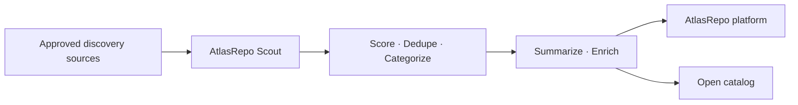

# AtlasRepo Open Source Catalog

**Evidence-backed open-source search for coding agents.**

[Documentation](https://atlasrepo.com/docs) · [Hosted MCP](https://mcp.atlasrepo.com/mcp) · [npm](https://www.npmjs.com/package/atlasrepo-mcp) · [Skills](https://github.com/Arnon-hs/atlasrepo-skills)

> A living, auto-curated catalog of open-source projects, enriched with practical summaries, categories, quality signals and transparent scoring.

## Purpose

This repository turns a fast-moving open-source ecosystem into a browsable and machine-readable decision layer. Use it to discover candidates, compare practical fit and give coding agents grounded starting points before deeper technical, security and license review.

## At a glance

| | |
|---|---|
| **Projects** | **40928** |
| **Categories** | **538** |
| **Refresh** | Continuously maintained by AtlasRepo Scout |
| **Metadata** | Repository signals, multilingual summaries and practical evaluations |

## Browse the catalog

| Category | Projects | |
|---|---|---|
| 📦 **Misc** | 16108 | [Browse →](./misc/) |
| 🤖 **AI/ML** | 4403 | [Browse →](./aiml/) |
| 🏷️ **Mcp** | 2781 | [Browse →](./mcp/) |
| 🧩 **Orchestration** | 2332 | [Browse →](./orchestration/) |
| 🔧 **DevTools** | 1580 | [Browse →](./devtools/) |
| 🏷️ **Automation** | 1411 | [Browse →](./automation/) |
| ⚙️ **Backend** | 933 | [Browse →](./backend/) |
| 🎨 **Frontend** | 886 | [Browse →](./frontend/) |
| ⛓️ **Crypto** | 783 | [Browse →](./crypto/) |
| 🏷️ **Documents** | 682 | [Browse →](./documents/) |
| 🏷️ **Networking** | 642 | [Browse →](./networking/) |
| 📱 **Mobile** | 629 | [Browse →](./mobile/) |
| 🏷️ **Knowledgerag** | 608 | [Browse →](./knowledgerag/) |
| 🏷️ **Cloud--storage** | 596 | [Browse →](./cloud--storage/) |
| 🏷️ **Database** | 532 | [Browse →](./database/) |
| 🚀 **DevOps & Infra** | 509 | [Browse →](./devopsinfra/) |
| 🏷️ **Video-editing** | 491 | [Browse →](./video-editing/) |
| 🏷️ **Templates** | 451 | [Browse →](./templates/) |
| 🏷️ **Communication** | 425 | [Browse →](./communication/) |
| 🔐 **Security** | 424 | [Browse →](./security/) |
| 📊 **Data** | 340 | [Browse →](./data/) |
| 🏷️ **Games--graphics** | 338 | [Browse →](./games--graphics/) |
| 💳 **Payments** | 337 | [Browse →](./payments/) |
| 🏷️ **Productivity** | 325 | [Browse →](./productivity/) |
| 🏷️ **Observability** | 301 | [Browse →](./observability/) |
| 🏷️ **Libraries--sdks** | 262 | [Browse →](./libraries--sdks/) |
| 📈 **Trading** | 204 | [Browse →](./trading/) |
| ✨ **Design** | 178 | [Browse →](./design/) |
| 🏷️ **Content-creation** | 146 | [Browse →](./content-creation/) |
| 🏷️ **Vertical-video** | 121 | [Browse →](./vertical-video/) |
| 🏷️ **Ai** | 121 | [Browse →](./ai/) |
| 🏷️ **Open-source** | 35 | [Browse →](./open-source/) |
| 🏷️ **Offline** | 33 | [Browse →](./offline/) |
| 🏷️ **Marketing** | 32 | [Browse →](./marketing/) |
| 🏷️ **Education** | 31 | [Browse →](./education/) |
| 🏷️ **Privacy** | 24 | [Browse →](./privacy/) |
| 🏷️ **Ai-agents** | 23 | [Browse →](./ai-agents/) |
| 🏷️ **Freelance** | 22 | [Browse →](./freelance/) |
| 🏷️ **Local-first** | 19 | [Browse →](./local-first/) |
| 🏷️ **Llm** | 19 | [Browse →](./llm/) |
| 🏷️ **Local-ai** | 15 | [Browse →](./local-ai/) |
| 🏷️ **Claude-code** | 13 | [Browse →](./claude-code/) |
| 🏷️ **Local-llm** | 13 | [Browse →](./local-llm/) |
| 🏷️ **Offline-first** | 10 | [Browse →](./offline-first/) |
| 🏷️ **Python** | 8 | [Browse →](./python/) |
| 🏷️ **N8n** | 8 | [Browse →](./n8n/) |
| 🏷️ **Self-hosting** | 8 | [Browse →](./self-hosting/) |
| 🎯 **Product** | 7 | [Browse →](./product/) |
| 🏷️ **Git** | 7 | [Browse →](./git/) |
| 🏷️ **Open-source-ai** | 6 | [Browse →](./open-source-ai/) |
| 🏷️ **Rust** | 6 | [Browse →](./rust/) |
| 🏷️ **Edge-ai** | 6 | [Browse →](./edge-ai/) |
| 🏷️ **Macos** | 5 | [Browse →](./macos/) |
| 🏷️ **Graph-database** | 5 | [Browse →](./graph-database/) |
| 🏷️ **Github-actions** | 5 | [Browse →](./github-actions/) |
| 🏷️ **Claude** | 5 | [Browse →](./claude/) |
| 🏷️ **Whatsapp** | 5 | [Browse →](./whatsapp/) |
| 🏷️ **Self-hosted** | 5 | [Browse →](./self-hosted/) |
| 🏷️ **Aws** | 5 | [Browse →](./aws/) |
| 🏷️ **Npm** | 4 | [Browse →](./npm/) |
| 🏷️ **Android** | 4 | [Browse →](./android/) |
| 🏷️ **Kubernetes** | 4 | [Browse →](./kubernetes/) |
| 🏷️ **Small-business** | 4 | [Browse →](./small-business/) |
| 🏷️ **Ecommerce** | 4 | [Browse →](./ecommerce/) |
| 🏷️ **Openapi** | 4 | [Browse →](./openapi/) |
| 🏷️ **Devsecops** | 4 | [Browse →](./devsecops/) |
| 🏷️ **Devchallenge** | 4 | [Browse →](./devchallenge/) |
| 🏷️ **Ci** | 4 | [Browse →](./ci/) |
| 🏷️ **Net** | 4 | [Browse →](./net/) |
| 🏷️ **Embedding** | 4 | [Browse →](./embedding/) |
| 🏷️ **Home-automation** | 4 | [Browse →](./home-automation/) |
| 🏷️ **Node** | 4 | [Browse →](./node/) |
| 🏷️ **Edge-computing** | 4 | [Browse →](./edge-computing/) |
| 🏷️ **Sanity** | 4 | [Browse →](./sanity/) |
| 🏷️ **Ai-agent** | 4 | [Browse →](./ai-agent/) |
| 🏷️ **Restaurant** | 3 | [Browse →](./restaurant/) |
| 🏷️ **Dj** | 3 | [Browse →](./dj/) |
| 🏷️ **Multi-agent** | 3 | [Browse →](./multi-agent/) |
| 🏷️ **Telegram** | 3 | [Browse →](./telegram/) |
| 🏷️ **E-commerce** | 3 | [Browse →](./e-commerce/) |
| 🏷️ **Agent-memory** | 3 | [Browse →](./agent-memory/) |
| 🏷️ **Github** | 3 | [Browse →](./github/) |
| 🏷️ **Documentation** | 3 | [Browse →](./documentation/) |
| 🏷️ **Agentic-workflows** | 3 | [Browse →](./agentic-workflows/) |
| 🏷️ **Go** | 3 | [Browse →](./go/) |
| 🏷️ **Windows** | 3 | [Browse →](./windows/) |
| 🏷️ **Php** | 3 | [Browse →](./php/) |
| 🏷️ **Embedded** | 3 | [Browse →](./embedded/) |
| 🏷️ **Offline-checks** | 3 | [Browse →](./offline-checks/) |
| 🏷️ **Salesforce** | 3 | [Browse →](./salesforce/) |
| 🏷️ **React** | 3 | [Browse →](./react/) |
| 🏷️ **Minecraft** | 3 | [Browse →](./minecraft/) |
| 🏷️ **Bug-bounty** | 3 | [Browse →](./bug-bounty/) |
| 🏷️ **3d** | 3 | [Browse →](./3d/) |
| 🏷️ **Invoice-generation** | 3 | [Browse →](./invoice-generation/) |
| 🏷️ **Hacktoberfest** | 3 | [Browse →](./hacktoberfest/) |
| 🏷️ **Terminal** | 3 | [Browse →](./terminal/) |
| 🏷️ **Ios** | 3 | [Browse →](./ios/) |
| 🏷️ **Ai-safety** | 3 | [Browse →](./ai-safety/) |
| 🏷️ **Coding-agents** | 3 | [Browse →](./coding-agents/) |
| 🏷️ **Cloudflare** | 3 | [Browse →](./cloudflare/) |
| 🏷️ **Ai-ops** | 3 | [Browse →](./ai-ops/) |
| 🏷️ **Air-quality** | 3 | [Browse →](./air-quality/) |
| 🏷️ **Offline-ai** | 3 | [Browse →](./offline-ai/) |
| 🏷️ **Hackathon** | 3 | [Browse →](./hackathon/) |
| 🏷️ **Escrow** | 3 | [Browse →](./escrow/) |
| 🏷️ **Pdf** | 2 | [Browse →](./pdf/) |
| 🏷️ **Cybersecurity** | 2 | [Browse →](./cybersecurity/) |
| 🏷️ **Resume-tailoring** | 2 | [Browse →](./resume-tailoring/) |
| 🏷️ **Iam** | 2 | [Browse →](./iam/) |
| 🏷️ **Inventory-forecasting** | 2 | [Browse →](./inventory-forecasting/) |
| 🏷️ **Storageoptimization** | 2 | [Browse →](./storageoptimization/) |
| 🏷️ **Code-graph** | 2 | [Browse →](./code-graph/) |
| 🏷️ **Desktop** | 2 | [Browse →](./desktop/) |
| 🏷️ **Exactmatch** | 2 | [Browse →](./exactmatch/) |
| 🏷️ **Monitoring** | 2 | [Browse →](./monitoring/) |
| 🏷️ **Tcg** | 2 | [Browse →](./tcg/) |
| 🏷️ **Deployment** | 2 | [Browse →](./deployment/) |
| 🏷️ **Privacy-first** | 2 | [Browse →](./privacy-first/) |
| 🏷️ **K3s** | 2 | [Browse →](./k3s/) |
| 🏷️ **Xapi** | 2 | [Browse →](./xapi/) |
| 🏷️ **Evm** | 2 | [Browse →](./evm/) |
| 🏷️ **Secondhand** | 2 | [Browse →](./secondhand/) |
| 🏷️ **Secret-scanning** | 2 | [Browse →](./secret-scanning/) |
| 🏷️ **X402** | 2 | [Browse →](./x402/) |
| 🏷️ **Wayland** | 2 | [Browse →](./wayland/) |
| 🏷️ **Allergen-labeling** | 2 | [Browse →](./allergen-labeling/) |
| 🏷️ **Static-analysis** | 2 | [Browse →](./static-analysis/) |
| 🏷️ **Rails** | 2 | [Browse →](./rails/) |
| 🏷️ **Llamaindex** | 2 | [Browse →](./llamaindex/) |
| 🏷️ **Ocr** | 2 | [Browse →](./ocr/) |
| 🏷️ **Architecture** | 2 | [Browse →](./architecture/) |
| 🏷️ **Agent-based-development** | 2 | [Browse →](./agent-based-development/) |
| 🏷️ **Text-to-speech** | 2 | [Browse →](./text-to-speech/) |
| 🏷️ **C** | 2 | [Browse →](./c/) |
| 🏷️ **Hysteria2** | 2 | [Browse →](./hysteria2/) |
| 🏷️ **Tmux** | 2 | [Browse →](./tmux/) |
| 🏷️ **Forecasting** | 2 | [Browse →](./forecasting/) |
| 🏷️ **Birdwatching** | 2 | [Browse →](./birdwatching/) |
| 🏷️ **Ai-code-review** | 2 | [Browse →](./ai-code-review/) |
| 🏷️ **Banking** | 2 | [Browse →](./banking/) |
| 🏷️ **Visualization** | 2 | [Browse →](./visualization/) |
| 🏷️ **Supabase** | 2 | [Browse →](./supabase/) |
| 🏷️ **Browser-automation** | 2 | [Browse →](./browser-automation/) |
| 🏷️ **Scraping** | 2 | [Browse →](./scraping/) |
| 🏷️ **Codex** | 2 | [Browse →](./codex/) |
| 🏷️ **Ui** | 2 | [Browse →](./ui/) |
| 🏷️ **Digital-products** | 2 | [Browse →](./digital-products/) |
| 🏷️ **Upi** | 2 | [Browse →](./upi/) |
| 🏷️ **Leadgeneration** | 2 | [Browse →](./leadgeneration/) |
| 🏷️ **Raft** | 2 | [Browse →](./raft/) |
| 🏷️ **Ai-coding** | 2 | [Browse →](./ai-coding/) |
| 🏷️ **Hextelegram** | 2 | [Browse →](./hextelegram/) |
| 🏷️ **Ai-testing** | 2 | [Browse →](./ai-testing/) |
| 🏷️ **Linux** | 2 | [Browse →](./linux/) |
| 🏷️ **On-device-ai** | 2 | [Browse →](./on-device-ai/) |
| 🏷️ **Speechtotext** | 2 | [Browse →](./speechtotext/) |
| 🏷️ **Data-contamination** | 2 | [Browse →](./data-contamination/) |
| 🏷️ **Cli** | 2 | [Browse →](./cli/) |
| 🏷️ **Yaml** | 2 | [Browse →](./yaml/) |
| 🏷️ **Astro** | 2 | [Browse →](./astro/) |
| 🏷️ **Open-weight-model** | 2 | [Browse →](./open-weight-model/) |
| 🏷️ **Benchmark** | 2 | [Browse →](./benchmark/) |
| 🏷️ **Outdoor** | 2 | [Browse →](./outdoor/) |
| 🏷️ **Nextjs** | 2 | [Browse →](./nextjs/) |
| 🏷️ **Desktop-automation** | 2 | [Browse →](./desktop-automation/) |
| 🏷️ **Stylometry** | 2 | [Browse →](./stylometry/) |
| 🏷️ **Investment** | 2 | [Browse →](./investment/) |
| 🏷️ **React-native** | 2 | [Browse →](./react-native/) |
| 🏷️ **Landslide** | 2 | [Browse →](./landslide/) |
| 🏷️ **Webgpu** | 2 | [Browse →](./webgpu/) |
| 🏷️ **Career-advice** | 2 | [Browse →](./career-advice/) |
| 🏷️ **Showdev** | 2 | [Browse →](./showdev/) |
| 🏷️ **Angular** | 2 | [Browse →](./angular/) |
| 🏷️ **System-one** | 2 | [Browse →](./system-one/) |
| 🏷️ **Cloud-native** | 2 | [Browse →](./cloud-native/) |
| 🏷️ **Docker** | 2 | [Browse →](./docker/) |
| 🏷️ **Local-models** | 2 | [Browse →](./local-models/) |
| 🏷️ **Video-generation** | 2 | [Browse →](./video-generation/) |
| 🏷️ **Resume** | 2 | [Browse →](./resume/) |
| 🏷️ **Agent-orchestration** | 2 | [Browse →](./agent-orchestration/) |
| 🏷️ **Free-tools** | 2 | [Browse →](./free-tools/) |
| 🏷️ **Monorepo** | 2 | [Browse →](./monorepo/) |
| 🏷️ **Apify** | 2 | [Browse →](./apify/) |
| 🏷️ **Autonomous-agent** | 2 | [Browse →](./autonomous-agent/) |
| 🏷️ **Ai-integration** | 2 | [Browse →](./ai-integration/) |
| 🏷️ **Deduplication** | 1 | [Browse →](./deduplication/) |
| 🏷️ **Personal-finance** | 1 | [Browse →](./personal-finance/) |
| 🏷️ **Side-project** | 1 | [Browse →](./side-project/) |
| 🏷️ **Gpustack** | 1 | [Browse →](./gpustack/) |
| 🏷️ **Handwriting-recognition** | 1 | [Browse →](./handwriting-recognition/) |
| 🏷️ **Drone** | 1 | [Browse →](./drone/) |
| 🏷️ **Supply-chain** | 1 | [Browse →](./supply-chain/) |
| 🏷️ **Youtube** | 1 | [Browse →](./youtube/) |
| 🏷️ **Ai-supervision** | 1 | [Browse →](./ai-supervision/) |
| 🏷️ **Home-assistant** | 1 | [Browse →](./home-assistant/) |
| 🏷️ **Ai-receptionist** | 1 | [Browse →](./ai-receptionist/) |
| 🏷️ **Shopify** | 1 | [Browse →](./shopify/) |
| 🏷️ **Agent-based-systems** | 1 | [Browse →](./agent-based-systems/) |
| 🏷️ **Online-sellers** | 1 | [Browse →](./online-sellers/) |
| 🏷️ **On-chain-audit** | 1 | [Browse →](./on-chain-audit/) |
| 🏷️ **Desktop-ai** | 1 | [Browse →](./desktop-ai/) |
| 🏷️ **Pii** | 1 | [Browse →](./pii/) |
| 🏷️ **Stateless** | 1 | [Browse →](./stateless/) |
| 🏷️ **Clipboard** | 1 | [Browse →](./clipboard/) |
| 🏷️ **Cncf** | 1 | [Browse →](./cncf/) |
| 🏷️ **Arxiv** | 1 | [Browse →](./arxiv/) |
| 🏷️ **Nda** | 1 | [Browse →](./nda/) |
| 🏷️ **Testing** | 1 | [Browse →](./testing/) |
| 🏷️ **I18n** | 1 | [Browse →](./i18n/) |
| 🏷️ **Visa-bulletin** | 1 | [Browse →](./visa-bulletin/) |
| 🏷️ **Agent-skills** | 1 | [Browse →](./agent-skills/) |
| 🏷️ **Browser-extension** | 1 | [Browse →](./browser-extension/) |
| 🏷️ **Ai-translation** | 1 | [Browse →](./ai-translation/) |
| 🏷️ **Cloud-security** | 1 | [Browse →](./cloud-security/) |
| 🏷️ **Voiceassistant** | 1 | [Browse →](./voiceassistant/) |
| 🏷️ **Ssl** | 1 | [Browse →](./ssl/) |
| 🏷️ **Learning-system** | 1 | [Browse →](./learning-system/) |
| 🏷️ **Evaluation** | 1 | [Browse →](./evaluation/) |
| 🏷️ **Product-audit** | 1 | [Browse →](./product-audit/) |
| 🏷️ **Audit** | 1 | [Browse →](./audit/) |
| 🏷️ **Portfolio-backtesting** | 1 | [Browse →](./portfolio-backtesting/) |
| 🏷️ **Authorization** | 1 | [Browse →](./authorization/) |
| 🏷️ **Urdb** | 1 | [Browse →](./urdb/) |
| 🏷️ **Receipt-ocr** | 1 | [Browse →](./receipt-ocr/) |
| 🏷️ **Scam-ad-checker** | 1 | [Browse →](./scam-ad-checker/) |
| 🏷️ **Job-hunting** | 1 | [Browse →](./job-hunting/) |
| 🏷️ **Blood-donation** | 1 | [Browse →](./blood-donation/) |
| 🏷️ **Family-tree** | 1 | [Browse →](./family-tree/) |
| 🏷️ **Cashflow** | 1 | [Browse →](./cashflow/) |
| 🏷️ **Receipt** | 1 | [Browse →](./receipt/) |
| 🏷️ **Decision-model** | 1 | [Browse →](./decision-model/) |
| 🏷️ **Quantization** | 1 | [Browse →](./quantization/) |
| 🏷️ **Ai-writing** | 1 | [Browse →](./ai-writing/) |
| 🏷️ **Government-tender** | 1 | [Browse →](./government-tender/) |
| 🏷️ **Distributed-computing** | 1 | [Browse →](./distributed-computing/) |
| 🏷️ **Video** | 1 | [Browse →](./video/) |
| 🏷️ **Citationaudit** | 1 | [Browse →](./citationaudit/) |
| 🏷️ **Menu-translation** | 1 | [Browse →](./menu-translation/) |
| 🏷️ **Metadata** | 1 | [Browse →](./metadata/) |
| 🏷️ **Link-extraction** | 1 | [Browse →](./link-extraction/) |
| 🏷️ **Kitchen** | 1 | [Browse →](./kitchen/) |
| 🏷️ **Allergy** | 1 | [Browse →](./allergy/) |
| 🏷️ **Recalls** | 1 | [Browse →](./recalls/) |
| 🏷️ **Lead-generation** | 1 | [Browse →](./lead-generation/) |
| 🏷️ **Photo-editing** | 1 | [Browse →](./photo-editing/) |
| 🏷️ **Auth** | 1 | [Browse →](./auth/) |
| 🏷️ **Epub** | 1 | [Browse →](./epub/) |
| 🏷️ **Performance-testing** | 1 | [Browse →](./performance-testing/) |
| 🏷️ **Threat-modeling** | 1 | [Browse →](./threat-modeling/) |
| 🏷️ **Local-inference** | 1 | [Browse →](./local-inference/) |
| 🏷️ **Debugging** | 1 | [Browse →](./debugging/) |
| 🏷️ **Image-generation** | 1 | [Browse →](./image-generation/) |
| 🏷️ **Electron** | 1 | [Browse →](./electron/) |
| 🏷️ **Energy** | 1 | [Browse →](./energy/) |
| 🏷️ **Agentgateway** | 1 | [Browse →](./agentgateway/) |
| 🏷️ **Gemma** | 1 | [Browse →](./gemma/) |
| 🏷️ **Ai-payments** | 1 | [Browse →](./ai-payments/) |
| 🏷️ **File-transfer** | 1 | [Browse →](./file-transfer/) |
| 🏷️ **Note-taking** | 1 | [Browse →](./note-taking/) |
| 🏷️ **Canvas** | 1 | [Browse →](./canvas/) |
| 🏷️ **Bike-fitting** | 1 | [Browse →](./bike-fitting/) |
| 🏷️ **Video-downloading** | 1 | [Browse →](./video-downloading/) |
| 🏷️ **Knowledge-graph** | 1 | [Browse →](./knowledge-graph/) |
| 🏷️ **Gpu** | 1 | [Browse →](./gpu/) |
| 🏷️ **Identity** | 1 | [Browse →](./identity/) |
| 🏷️ **Fastgpt** | 1 | [Browse →](./fastgpt/) |
| 🏷️ **Visual-observability** | 1 | [Browse →](./visual-observability/) |
| 🏷️ **Used-electronics** | 1 | [Browse →](./used-electronics/) |
| 🏷️ **Github-copilot** | 1 | [Browse →](./github-copilot/) |
| 🏷️ **Small-retail** | 1 | [Browse →](./small-retail/) |
| 🏷️ **Winget** | 1 | [Browse →](./winget/) |
| 🏷️ **Ontology** | 1 | [Browse →](./ontology/) |
| 🏷️ **Streaming** | 1 | [Browse →](./streaming/) |
| 🏷️ **Devsec** | 1 | [Browse →](./devsec/) |
| 🏷️ **Aiclaw** | 1 | [Browse →](./aiclaw/) |
| 🏷️ **Flight-search** | 1 | [Browse →](./flight-search/) |
| 🏷️ **Audio-drama** | 1 | [Browse →](./audio-drama/) |
| 🏷️ **Policy** | 1 | [Browse →](./policy/) |
| 🏷️ **Tiffin** | 1 | [Browse →](./tiffin/) |
| 🏷️ **Lease-abstraction** | 1 | [Browse →](./lease-abstraction/) |
| 🏷️ **Ai-agent-payments** | 1 | [Browse →](./ai-agent-payments/) |
| 🏷️ **Code-review** | 1 | [Browse →](./code-review/) |
| 🏷️ **Image-processing** | 1 | [Browse →](./image-processing/) |
| 🏷️ **Used-car** | 1 | [Browse →](./used-car/) |
| 🏷️ **Vs-code** | 1 | [Browse →](./vs-code/) |
| 🏷️ **Container** | 1 | [Browse →](./container/) |
| 🏷️ **Cacao** | 1 | [Browse →](./cacao/) |
| 🏷️ **Search-console** | 1 | [Browse →](./search-console/) |
| 🏷️ **Nonprofit** | 1 | [Browse →](./nonprofit/) |
| 🏷️ **Bug-triage** | 1 | [Browse →](./bug-triage/) |
| 🏷️ **Bitrix24** | 1 | [Browse →](./bitrix24/) |
| 🏷️ **Githubactions** | 1 | [Browse →](./githubactions/) |
| 🏷️ **Catalog-continuity** | 1 | [Browse →](./catalog-continuity/) |
| 🏷️ **Azure** | 1 | [Browse →](./azure/) |
| 🏷️ **Recycling** | 1 | [Browse →](./recycling/) |
| 🏷️ **Dev** | 1 | [Browse →](./dev/) |
| 🏷️ **Dual-write** | 1 | [Browse →](./dual-write/) |
| 🏷️ **Voice-ordering** | 1 | [Browse →](./voice-ordering/) |
| 🏷️ **Scope-management** | 1 | [Browse →](./scope-management/) |
| 🏷️ **Google-antigravity** | 1 | [Browse →](./google-antigravity/) |
| 🏷️ **Localization** | 1 | [Browse →](./localization/) |
| 🏷️ **Aliexpress** | 1 | [Browse →](./aliexpress/) |
| 🏷️ **Readme** | 1 | [Browse →](./readme/) |
| 🏷️ **Ai-assistant** | 1 | [Browse →](./ai-assistant/) |
| 🏷️ **Openweights** | 1 | [Browse →](./openweights/) |
| 🏷️ **Cucumber** | 1 | [Browse →](./cucumber/) |
| 🏷️ **Ai-generated-code** | 1 | [Browse →](./ai-generated-code/) |
| 🏷️ **Release-notes** | 1 | [Browse →](./release-notes/) |
| 🏷️ **Fastmcp** | 1 | [Browse →](./fastmcp/) |
| 🏷️ **Us-business-registry** | 1 | [Browse →](./us-business-registry/) |
| 🏷️ **Oh-my-graph** | 1 | [Browse →](./oh-my-graph/) |
| 🏷️ **Companies-house** | 1 | [Browse →](./companies-house/) |
| 🏷️ **Cross-device** | 1 | [Browse →](./cross-device/) |
| 🏷️ **Feature-reuse** | 1 | [Browse →](./feature-reuse/) |
| 🏷️ **Symfony** | 1 | [Browse →](./symfony/) |
| 🏷️ **Azure-logic-apps** | 1 | [Browse →](./azure-logic-apps/) |
| 🏷️ **Accessibility** | 1 | [Browse →](./accessibility/) |
| 🏷️ **Web-utilities** | 1 | [Browse →](./web-utilities/) |
| 🏷️ **Federal-prizes** | 1 | [Browse →](./federal-prizes/) |
| 🏷️ **Clinical-trials** | 1 | [Browse →](./clinical-trials/) |
| 🏷️ **Geology** | 1 | [Browse →](./geology/) |
| 🏷️ **Solana** | 1 | [Browse →](./solana/) |
| 🏷️ **Rag** | 1 | [Browse →](./rag/) |
| 🏷️ **Tabular** | 1 | [Browse →](./tabular/) |
| 🏷️ **Desktop-ide** | 1 | [Browse →](./desktop-ide/) |
| 🏷️ **Agent-hooks** | 1 | [Browse →](./agent-hooks/) |
| 🏷️ **Gemini-4-argon** | 1 | [Browse →](./gemini-4-argon/) |
| 🏷️ **Call-center** | 1 | [Browse →](./call-center/) |
| 🏷️ **Razer** | 1 | [Browse →](./razer/) |
| 🏷️ **Medication** | 1 | [Browse →](./medication/) |
| 🏷️ **Link-checking** | 1 | [Browse →](./link-checking/) |
| 🏷️ **Ui-testing** | 1 | [Browse →](./ui-testing/) |
| 🏷️ **Malware** | 1 | [Browse →](./malware/) |
| 🏷️ **Coding-agent** | 1 | [Browse →](./coding-agent/) |
| 🏷️ **Enterprise** | 1 | [Browse →](./enterprise/) |
| 🏷️ **Conventional-commits** | 1 | [Browse →](./conventional-commits/) |
| 🏷️ **Upgrade** | 1 | [Browse →](./upgrade/) |
| 🏷️ **Betting** | 1 | [Browse →](./betting/) |
| 🏷️ **Spectral** | 1 | [Browse →](./spectral/) |
| 🏷️ **Json-ld** | 1 | [Browse →](./json-ld/) |
| 🏷️ **Kotlin** | 1 | [Browse →](./kotlin/) |
| 🏷️ **Joomla** | 1 | [Browse →](./joomla/) |
| 🏷️ **Webmcp** | 1 | [Browse →](./webmcp/) |
| 🏷️ **Record-matching** | 1 | [Browse →](./record-matching/) |
| 🏷️ **Contract-review** | 1 | [Browse →](./contract-review/) |
| 🏷️ **Ai-research** | 1 | [Browse →](./ai-research/) |
| 🏷️ **Cocos** | 1 | [Browse →](./cocos/) |
| 🏷️ **Smart-agriculture** | 1 | [Browse →](./smart-agriculture/) |
| 🏷️ **Freight** | 1 | [Browse →](./freight/) |
| 🏷️ **Context-management** | 1 | [Browse →](./context-management/) |
| 🏷️ **Error-tracking** | 1 | [Browse →](./error-tracking/) |
| 🏷️ **Prompt-injection** | 1 | [Browse →](./prompt-injection/) |
| 🏷️ **Keywordspotting** | 1 | [Browse →](./keywordspotting/) |
| 🏷️ **Devops** | 1 | [Browse →](./devops/) |
| 🏷️ **Synthid** | 1 | [Browse →](./synthid/) |
| 🏷️ **Routing** | 1 | [Browse →](./routing/) |
| 🏷️ **Whiteboard** | 1 | [Browse →](./whiteboard/) |
| 🏷️ **Manim** | 1 | [Browse →](./manim/) |
| 🏷️ **Reverse-engineering** | 1 | [Browse →](./reverse-engineering/) |
| 🏷️ **Ollama** | 1 | [Browse →](./ollama/) |
| 🏷️ **Facebook** | 1 | [Browse →](./facebook/) |
| 🏷️ **Net-10** | 1 | [Browse →](./net-10/) |
| 🏷️ **Figma** | 1 | [Browse →](./figma/) |
| 🏷️ **Personal-agent** | 1 | [Browse →](./personal-agent/) |
| 🏷️ **Network-monitoring** | 1 | [Browse →](./network-monitoring/) |
| 🏷️ **Compiler** | 1 | [Browse →](./compiler/) |
| 🏷️ **Shrinkflation** | 1 | [Browse →](./shrinkflation/) |
| 🏷️ **Triage** | 1 | [Browse →](./triage/) |
| 🏷️ **Social-media** | 1 | [Browse →](./social-media/) |
| 🏷️ **Football** | 1 | [Browse →](./football/) |
| 🏷️ **Laravel** | 1 | [Browse →](./laravel/) |
| 🏷️ **Knowledge-work** | 1 | [Browse →](./knowledge-work/) |
| 🏷️ **Contract-analysis** | 1 | [Browse →](./contract-analysis/) |
| 🏷️ **Crm** | 1 | [Browse →](./crm/) |
| 🏷️ **Polymarket** | 1 | [Browse →](./polymarket/) |
| 🏷️ **Financial-automation** | 1 | [Browse →](./financial-automation/) |
| 🏷️ **Field-journal** | 1 | [Browse →](./field-journal/) |
| 🏷️ **Api-security** | 1 | [Browse →](./api-security/) |
| 🏷️ **Crash-recovery** | 1 | [Browse →](./crash-recovery/) |
| 🏷️ **Measurement** | 1 | [Browse →](./measurement/) |
| 🏷️ **Litter-collection** | 1 | [Browse →](./litter-collection/) |
| 🏷️ **Agent-cost** | 1 | [Browse →](./agent-cost/) |
| 🏷️ **Localfirst** | 1 | [Browse →](./localfirst/) |
| 🏷️ **Map-based** | 1 | [Browse →](./map-based/) |
| 🏷️ **Plant-care** | 1 | [Browse →](./plant-care/) |
| 🏷️ **Voice-first** | 1 | [Browse →](./voice-first/) |
| 🏷️ **Voicefirst** | 1 | [Browse →](./voicefirst/) |
| 🏷️ **Desktop-app** | 1 | [Browse →](./desktop-app/) |
| 🏷️ **Agent-framework** | 1 | [Browse →](./agent-framework/) |
| 🏷️ **Bird-identification** | 1 | [Browse →](./bird-identification/) |
| 🏷️ **Mlx** | 1 | [Browse →](./mlx/) |
| 🏷️ **Mobile-web** | 1 | [Browse →](./mobile-web/) |
| 🏷️ **Mcdonalds** | 1 | [Browse →](./mcdonalds/) |
| 🏷️ **Chatwoot** | 1 | [Browse →](./chatwoot/) |
| 🏷️ **Doomscroll** | 1 | [Browse →](./doomscroll/) |
| 🏷️ **Coding-assistants** | 1 | [Browse →](./coding-assistants/) |
| 🏷️ **Apple-ads** | 1 | [Browse →](./apple-ads/) |
| 🏷️ **Nlp** | 1 | [Browse →](./nlp/) |
| 🏷️ **Recommendation** | 1 | [Browse →](./recommendation/) |
| 🏷️ **Ai-workflow** | 1 | [Browse →](./ai-workflow/) |
| 🏷️ **Webdev** | 1 | [Browse →](./webdev/) |
| 🌐 **Open Source** | 1 | [Browse →](./opensource/) |
| 🏷️ **Repo-stars** | 1 | [Browse →](./repo-stars/) |
| 🏷️ **Karaoke** | 1 | [Browse →](./karaoke/) |
| 🏷️ **Muse-code** | 1 | [Browse →](./muse-code/) |
| 🏷️ **Openweight-models** | 1 | [Browse →](./openweight-models/) |
| 🏷️ **Air-gapped** | 1 | [Browse →](./air-gapped/) |
| 🏷️ **Erc-8004** | 1 | [Browse →](./erc-8004/) |
| 🏷️ **Web** | 1 | [Browse →](./web/) |
| 🏷️ **Dapr** | 1 | [Browse →](./dapr/) |
| 🏷️ **Programming-language** | 1 | [Browse →](./programming-language/) |
| 🏷️ **Agentic** | 1 | [Browse →](./agentic/) |
| 🏷️ **Food-safety** | 1 | [Browse →](./food-safety/) |
| 🏷️ **Ai-governance** | 1 | [Browse →](./ai-governance/) |
| 🏷️ **Console-development** | 1 | [Browse →](./console-development/) |
| 🏷️ **Autofill** | 1 | [Browse →](./autofill/) |
| 🏷️ **Quiz** | 1 | [Browse →](./quiz/) |
| 🏷️ **Audio-guide** | 1 | [Browse →](./audio-guide/) |
| 🏷️ **Chromium** | 1 | [Browse →](./chromium/) |
| 🏷️ **Pay-per-call** | 1 | [Browse →](./pay-per-call/) |
| 🏷️ **Mock-interviewer** | 1 | [Browse →](./mock-interviewer/) |
| 🏷️ **Gdpr** | 1 | [Browse →](./gdpr/) |
| 🏷️ **Notion** | 1 | [Browse →](./notion/) |
| 🏷️ **Browser-based** | 1 | [Browse →](./browser-based/) |
| 🏷️ **Document-management** | 1 | [Browse →](./document-management/) |
| 🏷️ **Study** | 1 | [Browse →](./study/) |
| 🏷️ **Nodejs** | 1 | [Browse →](./nodejs/) |
| 🏷️ **Handgesture** | 1 | [Browse →](./handgesture/) |
| 🏷️ **Studentportal** | 1 | [Browse →](./studentportal/) |
| 🏷️ **Politics** | 1 | [Browse →](./politics/) |
| 🏷️ **Microservices** | 1 | [Browse →](./microservices/) |
| 🏷️ **Symbolic-regression** | 1 | [Browse →](./symbolic-regression/) |
| 🏷️ **Current-affairs** | 1 | [Browse →](./current-affairs/) |
| 🏷️ **Postgresql** | 1 | [Browse →](./postgresql/) |
| 🏷️ **Eurorack** | 1 | [Browse →](./eurorack/) |
| 🏷️ **Web-development** | 1 | [Browse →](./web-development/) |
| 🏷️ **Test-management** | 1 | [Browse →](./test-management/) |
| 🏷️ **Vscode** | 1 | [Browse →](./vscode/) |
| 🏷️ **Raspberrypi** | 1 | [Browse →](./raspberrypi/) |
| 🏷️ **Okf** | 1 | [Browse →](./okf/) |
| 🏷️ **Raspberry-pi** | 1 | [Browse →](./raspberry-pi/) |
| 🏷️ **Neuroscience** | 1 | [Browse →](./neuroscience/) |
| 🏷️ **Agent-evaluation** | 1 | [Browse →](./agent-evaluation/) |
| 🏷️ **Clientside-validation** | 1 | [Browse →](./clientside-validation/) |
| 🏷️ **Family** | 1 | [Browse →](./family/) |
| 🏷️ **Gpu-rental** | 1 | [Browse →](./gpu-rental/) |
| 🏷️ **Atlassian** | 1 | [Browse →](./atlassian/) |
| 🏷️ **Smart-home** | 1 | [Browse →](./smart-home/) |
| 🏷️ **Vanilla-js** | 1 | [Browse →](./vanilla-js/) |
| 🏷️ **Readability** | 1 | [Browse →](./readability/) |
| 🏷️ **Environment-variables** | 1 | [Browse →](./environment-variables/) |
| 🏷️ **Media-player** | 1 | [Browse →](./media-player/) |
| 🏷️ **Decision-logging** | 1 | [Browse →](./decision-logging/) |
| 🏷️ **Goaltracking** | 1 | [Browse →](./goaltracking/) |
| 🏷️ **Live-streaming** | 1 | [Browse →](./live-streaming/) |
| 🏷️ **Webhook** | 1 | [Browse →](./webhook/) |
| 🏷️ **Deception** | 1 | [Browse →](./deception/) |
| 🏷️ **Speech-recognition** | 1 | [Browse →](./speech-recognition/) |
| 🏷️ **Certification** | 1 | [Browse →](./certification/) |
| 🏷️ **Decision-models** | 1 | [Browse →](./decision-models/) |
| 🏷️ **Web-scraping** | 1 | [Browse →](./web-scraping/) |
| 🏷️ **Release-engine** | 1 | [Browse →](./release-engine/) |
| 🏷️ **Tdee** | 1 | [Browse →](./tdee/) |
| 🏷️ **Autonomous-coding** | 1 | [Browse →](./autonomous-coding/) |
| 🏷️ **Argparse** | 1 | [Browse →](./argparse/) |
| 🏷️ **Payment** | 1 | [Browse →](./payment/) |
| 🏷️ **Anythingllm** | 1 | [Browse →](./anythingllm/) |
| 🏷️ **Ssh** | 1 | [Browse →](./ssh/) |
| 🏷️ **Trajectory** | 1 | [Browse →](./trajectory/) |
| 🏷️ **Federated-learning** | 1 | [Browse →](./federated-learning/) |
| 🏷️ **S7comm** | 1 | [Browse →](./s7comm/) |
| 🏷️ **Travel** | 1 | [Browse →](./travel/) |
| 🏷️ **Template** | 1 | [Browse →](./template/) |
| 🏷️ **Video-encoding** | 1 | [Browse →](./video-encoding/) |
| 🏷️ **Cabin-rules** | 1 | [Browse →](./cabin-rules/) |
| 🏷️ **Spring-boot** | 1 | [Browse →](./spring-boot/) |
| 🏷️ **Browser-based-ai** | 1 | [Browse →](./browser-based-ai/) |
| 🏷️ **Batch-processing** | 1 | [Browse →](./batch-processing/) |
| 🏷️ **Perl** | 1 | [Browse →](./perl/) |
| 🏷️ **Agent** | 1 | [Browse →](./agent/) |
| 🏷️ **Opencode** | 1 | [Browse →](./opencode/) |
| 🏷️ **Data-validation** | 1 | [Browse →](./data-validation/) |
| 🏷️ **Version-control** | 1 | [Browse →](./version-control/) |
| 🏷️ **Dns** | 1 | [Browse →](./dns/) |
| 🏷️ **Chatbot** | 1 | [Browse →](./chatbot/) |
| 🏷️ **Sidecar** | 1 | [Browse →](./sidecar/) |
| 🏷️ **Claude-desktop** | 1 | [Browse →](./claude-desktop/) |
| 🏷️ **Migration** | 1 | [Browse →](./migration/) |
| 🏷️ **Background-removal** | 1 | [Browse →](./background-removal/) |
| 🏷️ **Dependency-management** | 1 | [Browse →](./dependency-management/) |
| 🏷️ **Job-search** | 1 | [Browse →](./job-search/) |
| 🏷️ **Invoice** | 1 | [Browse →](./invoice/) |
| 🏷️ **Meeting-notes** | 1 | [Browse →](./meeting-notes/) |
| 🏷️ **Cosmic** | 1 | [Browse →](./cosmic/) |
| 🏷️ **Postgres** | 1 | [Browse →](./postgres/) |
| 🏷️ **Nestjs** | 1 | [Browse →](./nestjs/) |
| 🏷️ **Ai-image-generation** | 1 | [Browse →](./ai-image-generation/) |
| 🏷️ **Secrets-management** | 1 | [Browse →](./secrets-management/) |
| 🏷️ **Skill-evolution** | 1 | [Browse →](./skill-evolution/) |
| 🏷️ **Profinet** | 1 | [Browse →](./profinet/) |
| 🏷️ **Web-games** | 1 | [Browse →](./web-games/) |
| 🏷️ **Apx** | 1 | [Browse →](./apx/) |
| 🏷️ **Igaming** | 1 | [Browse →](./igaming/) |
| 🏷️ **Learning** | 1 | [Browse →](./learning/) |
| 🏷️ **Mutation-testing** | 1 | [Browse →](./mutation-testing/) |
| 🏷️ **Wordpress** | 1 | [Browse →](./wordpress/) |
| 🏷️ **Koha** | 1 | [Browse →](./koha/) |
| 🏷️ **Agent-loop** | 1 | [Browse →](./agent-loop/) |
| 🏷️ **Audio** | 1 | [Browse →](./audio/) |
| 🏷️ **Performance** | 1 | [Browse →](./performance/) |
| 🏷️ **Risk-modeling** | 1 | [Browse →](./risk-modeling/) |
| 🏷️ **Rewriting** | 1 | [Browse →](./rewriting/) |
| 🏷️ **Harness** | 1 | [Browse →](./harness/) |
| 🏷️ **Dex** | 1 | [Browse →](./dex/) |
| 🏷️ **Personal-website** | 1 | [Browse →](./personal-website/) |
| 🏷️ **Serverless** | 1 | [Browse →](./serverless/) |
| 🏷️ **Thread-dump** | 1 | [Browse →](./thread-dump/) |
| 🏷️ **Micropayments** | 1 | [Browse →](./micropayments/) |
| 🏷️ **Webhooks** | 1 | [Browse →](./webhooks/) |
| 🏷️ **Ide** | 1 | [Browse →](./ide/) |
| 🏷️ **Quantum-computing** | 1 | [Browse →](./quantum-computing/) |
| 🏷️ **Rpa** | 1 | [Browse →](./rpa/) |
| 🏷️ **Expense-management** | 1 | [Browse →](./expense-management/) |
| 🏷️ **Bot-protection** | 1 | [Browse →](./bot-protection/) |
| 🏷️ **Ttrpg** | 1 | [Browse →](./ttrpg/) |
| 🏷️ **Blockchain** | 1 | [Browse →](./blockchain/) |
| 🏷️ **Open-data** | 1 | [Browse →](./open-data/) |
| 🏷️ **Dart** | 1 | [Browse →](./dart/) |
| 🏷️ **Ajax** | 1 | [Browse →](./ajax/) |
| 🏷️ **Tiny-llm** | 1 | [Browse →](./tiny-llm/) |
| 🏷️ **Pomodoro** | 1 | [Browse →](./pomodoro/) |
| 🏷️ **Excel** | 1 | [Browse →](./excel/) |
| 🏷️ **Agents** | 1 | [Browse →](./agents/) |
| 🏷️ **Auditability** | 1 | [Browse →](./auditability/) |
| 🏷️ **Cost-estimation** | 1 | [Browse →](./cost-estimation/) |
| 🏷️ **Qa** | 1 | [Browse →](./qa/) |
| 🏷️ **Scheduler** | 1 | [Browse →](./scheduler/) |

## Top projects by score

| # | Project | Stars | Category |
|---|---|---|---|
| 1 | [sickn33/agentic-awesome-skills](./orchestration/sickn33-agentic-awesome-skills.md) | ⭐ 42.6k | Orchestration |
| 2 | [Panniantong/Agent-Reach](./mcp/panniantong-agent-reach.md) | ⭐ 44.7k | Mcp |
| 3 | [headroomlabs-ai/headroom](./orchestration/headroomlabs-ai-headroom.md) | ⭐ 46.8k | Orchestration |
| 4 | [wasp-lang/open-saas](./templates/wasp-lang-open-saas.md) | ⭐ 14.9k | Templates |
| 5 | [xberg-io/xberg](./mcp/xberg-io-xberg.md) | ⭐ 8.5k | Mcp |
| 6 | [xberg-io/kreuzberg](./mcp/xberg-io-kreuzberg.md) | ⭐ 8.5k | Mcp |
| 7 | [diegosouzapw/OmniRoute](./mcp/diegosouzapw-omniroute.md) | ⭐ 6.7k | Mcp |
| 8 | [langgenius/dify](./orchestration/langgenius-dify.md) | ⭐ 146.2k | Orchestration |
| 9 | [zeromicro/go-zero](./aiml/zeromicro-go-zero.md) | ⭐ 33.2k | AI/ML |
| 10 | [firerpa/lamda](./mcp/firerpa-lamda.md) | ⭐ 7.9k | Mcp |

## What each entry includes

| Signal | Why it matters |
|---|---|
| Repository activity | Stars, forks, language and last update provide a quick health snapshot |
| Practical summary | Concise English, Russian and Chinese context for faster evaluation |
| Fit and readiness | Use cases, integration notes, quality signals and production-readiness notes |
| Transparent score | A directional breakdown across usefulness, quality, integration, readiness, outlook and adoption |

## How it works


```mermaid
graph LR
  A[Approved discovery sources] --> B[AtlasRepo Scout]
  B --> C[Score · Dedupe · Categorize]
  C --> D[Summarize · Enrich]
  D --> E[AtlasRepo platform]
  D --> F[Open catalog]
```

1. **Discover** — collect candidates from approved public sources.
2. **Normalize** — deduplicate repositories and standardize metadata.
3. **Evaluate** — score practical value, quality, integration fit, readiness, outlook and adoption.
4. **Enrich** — add categories, summaries, use cases, quality signals and risk notes.
5. **Publish** — update the AtlasRepo platform and this open catalog.

## Install

### ChatGPT — hosted MCP plugin

1. Open **Settings → Security and login** and enable **Developer mode**.
2. Open [ChatGPT Plugins](https://chatgpt.com/#settings/Plugins), select **+**, and create a connection named `AtlasRepo`.
3. Set the MCP endpoint to `https://mcp.atlasrepo.com/mcp`, create the connection, and review the discovered read-only tools.

Developer mode availability depends on your account and workspace policy. See the [official OpenAI connection guide](https://developers.openai.com/plugins/deploy/connect-chatgpt).

### Claude Code

Plugin:

```text
/plugin marketplace add Arnon-hs/atlasrepo-skills
/plugin install atlasrepo@atlasrepo-skills
/reload-plugins
```

Hosted MCP only:

```bash
claude mcp add --transport http atlasrepo https://mcp.atlasrepo.com/mcp
```

Local npm MCP instead:

```bash
claude mcp add --transport stdio atlasrepo -- npx -y atlasrepo-mcp
```

Browse the [AtlasRepo Skills repository](https://github.com/Arnon-hs/atlasrepo-skills) or inspect the [`scout-rest-api` skill source](https://github.com/Arnon-hs/atlasrepo-skills/tree/main/plugins/atlasrepo/skills/scout-rest-api). Claude plugin commands follow the [official marketplace flow](https://code.claude.com/docs/en/discover-plugins); MCP-only commands follow the [official Claude MCP syntax](https://code.claude.com/docs/en/mcp).

## Data contract

- [`index.json`](./index.json) — machine-readable entry point, either a complete sorted index or a shard manifest for large snapshots.
- `data/repos-*.json` — machine-readable catalog shards when sharding is enabled.
- `<category>/README.md` — ranked category index.
- `<category>/<owner>-<name>.md` — human-readable project card with evidence and evaluation metadata.

## Trust boundary

Catalog records, scores, summaries and external installation commands are discovery aids, not endorsements or security guarantees. Verify repository ownership, current maintenance, dependencies, license compatibility and installation steps before adoption.

## License

MIT for this repository's catalog metadata. See [LICENSE](./LICENSE). Linked repositories remain governed by their respective licenses.
